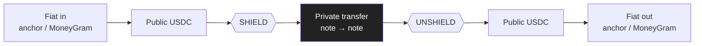
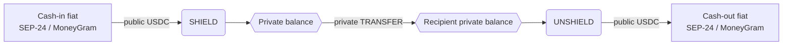
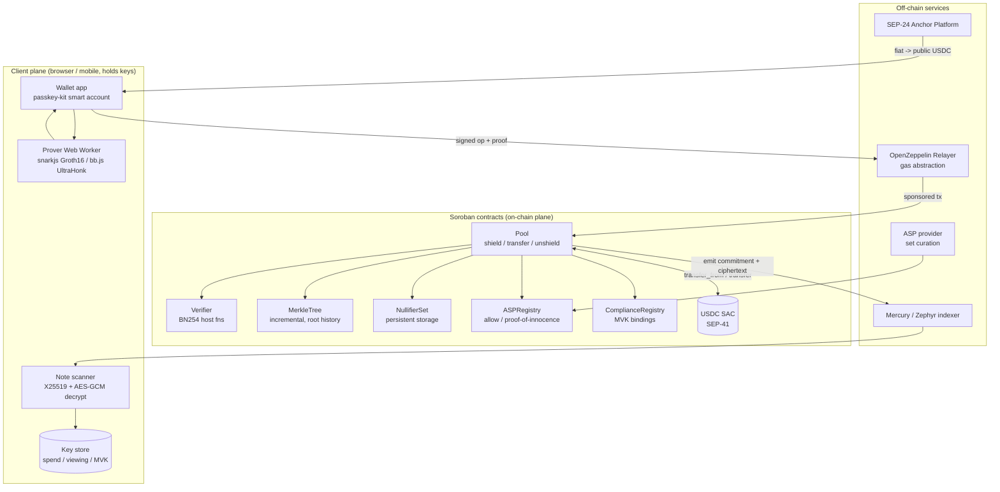
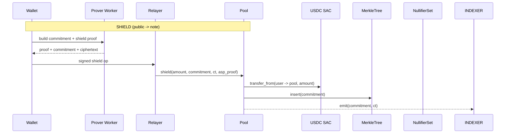
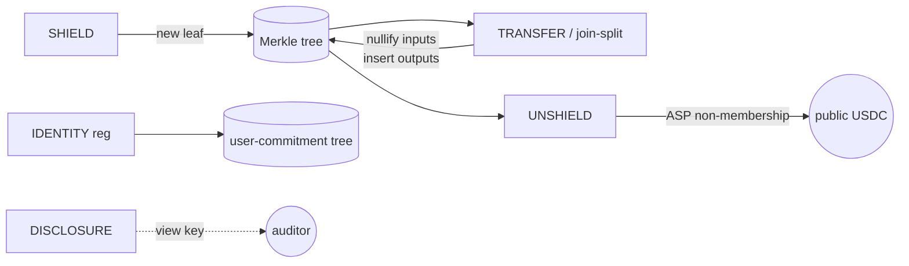
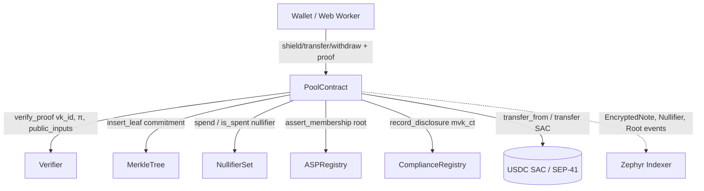
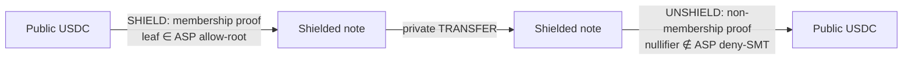
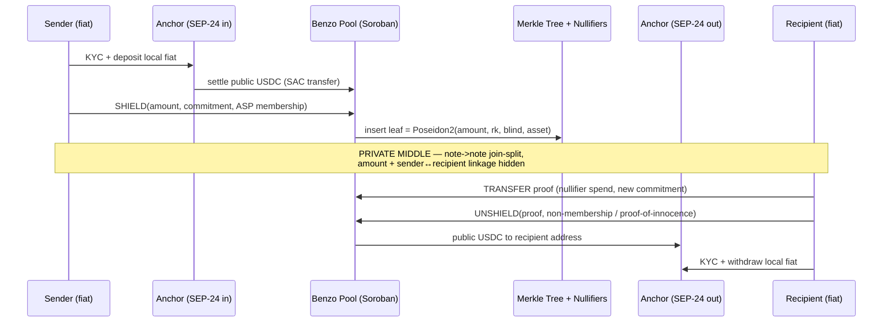
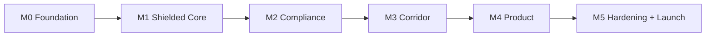

# Benzo

### Private money for the real world — a shielded-USDC payments protocol on Stellar

> **Benzo** is a private-by-default, shielded-USDC payments protocol and consumer wallet on Stellar, delivered first as a private cross-border remittance corridor. Everyday stablecoin payments hide both amount and counterparty through zero-knowledge shielded notes, while compliance — selective disclosure via hierarchical viewing keys and Association-Set screening — is built into the regulated edges. It is non-custodial, passkey-onboarded, gasless, and engineered as a protocol others build on.

**Document type:** Design & Engineering Specification · **Status:** Living document (v0.1) · **Network:** Stellar / Soroban (Protocol 25 "X-Ray" + Protocol 26 "Yardstick")

---

## Canonical Cryptographic Invariants (normative)

These definitions are authoritative. Where a section below uses shorter phrasing, read it as shorthand for these. Implementations **MUST** keep the Poseidon2 parameterization byte-identical between the circuits (Circom / Noir) and the Soroban host function, or commitments and nullifiers will not match.

| Invariant | Canonical definition |
|---|---|
| **Hash primitive** | **Poseidon2** for all commitments, nullifiers, and Merkle nodes (CAP-0075 host function). |
| **Note commitment** | `commitment = Poseidon2(amount, recipient_pk, blinding, asset_id)` |
| **Nullifier** | `nullifier = Poseidon2(spend_sk, leaf_index, NULLIFIER_DOMAIN)` |
| **Merkle node** | `parent = Poseidon2(left, right)`; tree `DEPTH = 32` (default, ~4.3B notes); `ROOT_HISTORY = 128` recent roots accepted on spend. |
| **Operation verbs** | `shield`, `transfer`, `unshield`. The `unshield` operation is exposed on-chain as the `withdraw` entrypoint; the SDK surface uses `unshield`. |
| **Proof verification** | Groth16 via a single constant-size `bn254_multi_pairing_check` (4 pairing terms) — ~12M of the ~100M per-transaction instruction budget. |
| **Nullifier storage** | Soroban **persistent** storage only (never temporary); idempotent "already spent = success". |

---

## Current Build Scope — Backend / Protocol Only

This document captures the full product vision (per the no-cut-ambition principle), but the **active build scope is backend and protocol only — there is no frontend/UI work in scope right now.**

**In scope now (backend / protocol):** the ZK circuits and a **headless proving harness** (Node/CLI — no browser), the Soroban contracts (`pool`, `verifier`, `merkle`, `nullifier_set`, `asp_registry`, `compliance`), the **headless `@benzo/sdk`** TypeScript library, the note-discovery indexer, the relayer configuration, the server-side SEP-24 anchor integration, deploy/ceremony scripts, and the full test suite.

**Deferred (frontend / product UI):** the consumer wallet app (`app/`), all of **Section 3 (Product Experience)** and its screens / optimistic UI, passkey-secp256r1 onboarding UX and Stellar Wallets Kit (contracts stay **auth-agnostic** — use an Ed25519 CLI keypair for now), the "Add cash / Cash out" UI, and the browser Web Worker prover (the same prover, embedded in a UI later).

Where a section below describes UI, optimistic rendering, passkeys, or "screens," treat it as the **deferred product layer** — documented to preserve the vision, not built now. Client-side proving still holds as an architectural property; in this scope it is exercised via a CLI/Node harness, then embedded in a browser later.

---

## Table of Contents

1. [Executive Summary & Vision](#1-executive-summary--vision)
2. [The Problem & Market Opportunity](#2-the-problem--market-opportunity)
3. [Product Experience](#3-product-experience)
4. [System Architecture](#4-system-architecture)
5. [Zero-Knowledge Design: Circuits & Proving](#5-zero-knowledge-design-circuits--proving)
6. [Smart Contracts on Soroban](#6-smart-contracts-on-soroban)
7. [Compliance & Selective Disclosure](#7-compliance--selective-disclosure)
8. [Fiat Edges & the Remittance Corridor](#8-fiat-edges--the-remittance-corridor)
9. [Technology Stack & SDK Reference](#9-technology-stack--sdk-reference)
10. [Engineering Plan: Repo Structure, Build Components & Roadmap](#10-engineering-plan-repo-structure-build-components--roadmap)

---


## 1. Executive Summary & Vision

**Benzo is a private-by-default, shielded-USDC payments protocol and consumer wallet on Stellar, delivered first as a private cross-border remittance corridor.** At its core is a UTXO-style shielded-note scheme: each note is a Poseidon commitment `Poseidon2(amount, recipient_key, blinding, asset)` inserted as a leaf in an on-chain incremental Merkle tree, spent by revealing a Poseidon2-PRF nullifier persisted in on-chain storage to prevent double-spend. Three operations — `shield` (public USDC → note), `transfer` (note → note join-split), and `unshield` (note → public USDC) — together hide both transaction amounts and the sender↔recipient link, while the money itself stays real Circle USDC custodied by a Soroban pool contract via the Stellar Asset Contract (SAC / SEP-41). Validity is enforced by a Groth16 verifier contract running on Stellar's native BN254 host functions, with proofs generated client-side in a browser Web Worker. Benzo is non-custodial, with compliance — selective disclosure via hierarchical viewing keys and Association-Set membership — built into the edges rather than bolted on.

### The three-layer vision

Benzo is engineered as a stack, not a single app:

| Layer | What it is | Who it serves |
|---|---|---|
| **1. Consumer wallet** | A passkey-onboarded, gasless wallet where everyday USDC payments are private by default — send, receive, shield, and cash out across borders | End users, remittance senders/recipients |
| **2. Embeddable SDK** | The shielded-note core (commitment/nullifier/Merkle logic, proving Web Worker, note-discovery scanner, verifier ABI) packaged as a reusable library other wallets and apps drop in | Wallet builders, fintechs, dApps on Stellar |
| **3. Institutional confidential settlement** | Confidential payroll and B2B settlement on the same notes, with passive-auditor disclosure for regulators and counterparties | Payroll providers, treasuries, regulated institutions |

The same cryptographic primitive — the shielded note — powers all three. A payroll run is a batch of `transfer`s; a remittance is a `shield → transfer → unshield` path; an SDK integration is the consumer wallet's note engine exposed as an interface. Build the core once; ship it three ways.

### The wedge: a private remittance corridor

The flagship product narrative is a corridor: **fiat → public USDC (anchor) → `shield` → private `transfer` → `unshield` → public USDC → fiat.** Privacy lives in the middle of the path; KYC and selective disclosure live at the regulated fiat edges. The on-ramp/off-ramp uses real SEP-24 hosted deposit/withdrawal through the [Stellar Anchor Platform](https://github.com/stellar/anchor-platform), with a production path to [MoneyGram Ramps](https://developers.stellar.org/docs/tools/ramps/moneygram) (174 countries). A corridor is a sharp, demonstrable wedge into the broad "private money network" thesis — one country pair, one lived workflow, generalizable to the whole network.

### Why ZK is load-bearing

Strip the zero-knowledge layer and there is no product. The notes *are* the privacy: the Poseidon commitment hides the amount, the nullifier severs the spend-graph link, and the Groth16 proof is the only thing convincing the on-chain pool that a spend is valid without revealing which note was spent or for how much. There is no encrypted-balance or MPC fallback to lean on — unlike Umbra's Arcium-MPC model, Benzo is pure ZK, because the notes already hide amounts, so no MPC layer is needed. Remove the proofs and you are left with a transparent SAC ledger: ordinary public USDC. The cryptography is the moat, not a feature.

```
  fiat  ──anchor──▶  public USDC  ──shield──▶  ┌──────────────┐
                                               │  shielded    │  private
                                               │  note pool   │  transfer
  fiat  ◀─anchor──   public USDC  ◀─unshield── └──────────────┘
   └── KYC / disclosure ──┘          privacy lives here ──┘
```

### Why now, and why Stellar

The primitives only recently became viable on a real money network. Protocol 25 "X-Ray" shipped native BN254 host functions (`bn254_g1_add`, `bn254_g1_mul`, `bn254_multi_pairing_check`; [CAP-0074](https://developers.stellar.org/docs/build/apps/zk)) and Poseidon/Poseidon2 permutation host functions (CAP-0075), and Protocol 26 "Yardstick" added multi-scalar multiplication and scalar-field arithmetic that make Noir/UltraHonk verification meaningfully cheaper. A Groth16 verify now costs roughly 12M of the ~100M per-transaction CPU-instruction budget — about 12% — leaving ample headroom for tree updates and nullifier writes. Stellar is the right substrate precisely because it is *real-world money movement*: Circle-issued USDC, sub-cent fees, passkey smart wallets via [passkey-kit](https://github.com/kalepail/passkey-kit), gasless UX through OpenZeppelin Relayer / Stellar Channels Service, and live fiat rails through anchors and MoneyGram. The closest starter code — [Nethermind's Stellar Private Payments PoC](https://github.com/NethermindEth/stellar-private-payments) — and the canonical [Groth16 verifier](https://github.com/stellar/soroban-examples/tree/main/groth16_verifier) prove the path is walkable.

### Market validation and the funded thesis

Compliant privacy with selective disclosure is a repeatedly VC-funded thesis. **Payy** (Ethereum L2, Halo2) is the closest analog — 100k+ users across 120 countries, ~$130M annualized, $6M FirstMark seed. **Railgun** has shielded ~$4B cumulative with an EF/Kohaku integration; **0xbow Privacy Pools** raised $3.5M (Coinbase Ventures, Vitalik) and pioneered proof-of-innocence; **Circle USDCx** and **Paxos USAD** on Aleo show regulated issuers shipping view-key private stablecoins; the Zcash privacy sector rose +288% in 2025. The whitespace is specific: **no live-mainnet shielded real-USDC consumer product exists, and the private-remittance-corridor framing is unproven anywhere.** That is genuine first-mover territory *and* an honestly unvalidated hypothesis. Benzo's edge is not the privacy primitive alone — it is the integrated product riding Stellar's real fiat-anchor and MoneyGram rails.

### The ambition

Benzo is built to be a protocol others build on, shipped as a real consumer product, and engineered to be maintained and extended — versioned verifier contracts with an upgrade path, a documented trusted-setup ceremony, a published SDK with stable interfaces, a written threat model, and observability from day one. A private money network for the real world, on Stellar.

---

## 2. The Problem & Market Opportunity

### 2.1 Transparency Is a Feature — Until It Isn't

Stellar's ledger is fully public by construction. Every `payment`, `pathPaymentStrictReceive`, and `clawback` operation exposes the source account, destination account, asset, and exact amount to anyone running Horizon or querying an indexer. That radical transparency is excellent for auditability and terrible for almost every real-world money flow:

- **Payroll.** Paying salaries on-chain publishes every employee's compensation, raise cadence, and bonus to coworkers, competitors, and recruiters. No serious employer will run payroll on a rail where `GBOSS… → GEMPLOYEE…: 8,400 USDC` is permanently world-readable.
- **Treasury & vendors.** A company's runway, supplier list, unit economics, and margins are reconstructable from its address graph. Counterparties front-run; competitors map the supply chain.
- **Remittances.** A migrant worker sending money home leaks the corridor, the cadence, and the amount — and links the recipient's account to every other transfer they receive, an obvious safety and dignity problem.

The result is a structural adoption ceiling: the entities that move the most money — businesses, payroll providers, remittance operators — *cannot* use transparent rails for their core flows without leaking commercially sensitive or personally dangerous information. Stablecoin volume keeps climbing, but the high-value, recurring B2B and remittance flows stay off-chain precisely because of transparency. Privacy is not a niche feature here; it is the precondition for the next order of magnitude of on-chain payment volume.

### 2.2 The Compliant-Privacy Sweet Spot

The naive fix — full, unconditional anonymity — is a regulatory dead end. The market has run this experiment publicly:

| Tool | Model | Outcome |
|------|-------|---------|
| Tornado Cash | Pure anonymity, no disclosure | OFAC-sanctioned (2022); developer-liability precedent |
| Railgun | Shielded pool + viewing keys + Private Proofs of Innocence | ~$4B cumulative shielded; EF Kohaku integration |
| 0xbow Privacy Pools | ASP membership / proof-of-innocence | $3.5M seed (Coinbase Ventures, Vitalik); EF-aligned |
| Aleo USDCx / Paxos USAD | View-key private stablecoin, regulated issuer | Regulated issuers shipping confidential stablecoins |

The pattern is unambiguous: tools offering *only* anonymity get sanctioned and abandoned; tools offering **privacy with selective disclosure** attract capital, integrations, and regulated issuers. The thesis — "open by default, private when needed, compliant" — is repeatedly VC-funded, not speculative. Benzo is built on exactly this axis: shielded notes hide amounts and the sender↔recipient link, while hierarchical viewing keys (Master Viewing Key → time-scoped Transaction Viewing Keys) and ASP membership-at-deposit / non-membership-at-withdrawal keep KYC and disclosure at the regulated fiat edges. This is the design space charted in Stellar's own [Privacy on Stellar](https://developers.stellar.org/docs/build/apps/privacy) and [ZK Proofs](https://developers.stellar.org/docs/build/apps/zk) guidance.

The recent Circle freeze of an entire confidential-USDC contract (May 2026, later reversed by court) is a live data point, not a deterrent: it sharpens *why* Benzo must be non-custodial and address-level rather than contract-level in its disclosure design, and why compliance hooks belong in the protocol from the start.

### 2.3 Sizing the Opportunity

- **Stablecoin payments** settled roughly **$390B in 2025**, growing into the dominant on-chain settlement primitive — and the share that is recurring payroll/treasury/vendor/remittance flow is precisely the share that transparency currently blocks.
- **Remittances** (~$650B+ annual global flow) are migrating on-chain corridor by corridor, where stablecoins undercut the 6%+ legacy fee load.
- **MoneyGram MGUSD** is launching natively on Stellar with cash-in/cash-out across 174 countries via [MoneyGram Ramps](https://developers.stellar.org/docs/tools/ramps/moneygram) — the exact fiat edge a private corridor needs. Stellar is where regulated fiat actually touches chain.



KYC and selective disclosure live at the regulated edges (A, G); privacy lives in the middle (D). This is the only segment of the value chain transparent rails cannot serve.

### 2.4 Competitive Landscape — Honestly

**On Stellar.** The space is early and mostly pre-product. The [Nethermind Stellar Private Payments PoC](https://github.com/NethermindEth/stellar-private-payments) is the closest reference implementation — a Groth16/Circom shielded-pool proof-of-concept and Benzo's natural starting code, but a PoC, not a consumer product, with no fiat edges, no compliance layer, and no real-USDC custody. Other Stellar efforts (Moonlight, Arcane, LumenShade, and wallet incumbents like xBull) are either research-stage, narrow, or transparent wallets without a shielded-note core. None ship a live, mainnet, real-USDC private payment product with selective disclosure.

**Other chains.** [Payy](https://payy.network) (Ethereum L2, Halo2 — 100k+ users, 120 countries, ~$130M annualized, $6M FirstMark seed) is the closest *product* analog and proof that compliant consumer privacy scales — but it is not USDC-native, not on Stellar's fiat rails, and not corridor-framed. Railgun, Umbra (Solana/Arcium-MPC), and Aleo USDCx validate the primitive on their own chains but none combine **real Circle USDC + Stellar anchors + a remittance-corridor product + built-in compliance**.

### 2.5 The Whitespace — and the Honest Caveat

Benzo's edge is not the privacy primitive in isolation; shielded notes are well-trodden cryptography. The whitespace is the **integrated stack**: real Circle USDC custodied via the Stellar Asset Contract, private shielded transfers in the middle, KYC/disclosure at SEP-24 / MoneyGram fiat edges, ASP-based compliance, and a passkey-onboarded consumer wallet — *on the chain where regulated money actually moves*. No live-mainnet shielded real-USDC consumer product exists today, and the private-remittance-corridor framing is unproven anywhere.

That cuts both ways, and we state it plainly: this is **genuine first-mover whitespace and an unvalidated hypothesis**. The compliant-privacy thesis is validated (Payy, Railgun, 0xbow); private *remittance corridors specifically* are not yet proven at scale. Benzo is architected to test that hypothesis on production rails — measurable corridor volume, retention, and disclosure usage — rather than to assume it. The bet is that privacy is the missing precondition for on-chain payroll, treasury, and remittance, and Stellar is the rail with the fiat edges to prove it.

---

## 3. Product Experience

> **⏸ Deferred — product / UI layer.** This entire section is **out of the current build scope** (backend-only). It is retained to preserve the product vision; nothing here is built until the frontend phase. Everything it describes is exposed headlessly by the contracts, `@benzo/sdk`, and CLI, so the UI can be layered on later without protocol changes.

Benzo's product thesis is that privacy must be *invisible*. The user-facing surface borrows zero vocabulary from cryptography: there is **never a word on screen that does not also exist in Venmo or Cash App**. No "shield," no "note," no "nullifier," no "Merkle root," no "proof." Privacy is plumbing — like HTTPS, it is on by default, indicated by a small lock, and never asks permission. The shielded-note engine from Section 4 runs entirely beneath a balance, a contact list, and a green "Send" button.

### 3.1 UX Philosophy: optimistic UI over the proving pipeline

Groth16 witness generation + proving in a browser Web Worker takes meaningful wall-clock time. We never make the user watch it. The interface is **optimistic**: the moment a user confirms a send, the recipient row animates to "Sent," the balance decrements locally, and a subtle shimmer marks the transaction as "settling." Behind the shimmer, the worker (a) selects input notes, (b) builds the join-split witness, (c) proves, (d) submits via the gasless relayer, and (e) confirms the `transfer` ledger entry. If verification fails (e.g., a stale Merkle path), the UI silently rebuilds against the fresh root and retries; only a hard, repeated failure surfaces an error. Proof generation is a spinner the user should almost never see.

```
User taps Send ─┐
                ├─▶ [UI] optimistic "Sent ✓"  (instant)
                └─▶ [Worker] pick notes → witness → Groth16 prove
                              → relayer submits → on-chain verify
                              → "Settled 🔒"  (background)
```

### 3.2 Onboarding: no seed, ever

First launch is a single tap. Benzo creates a **passkey smart wallet** via [passkey-kit](https://github.com/kalepail/passkey-kit) / [smart-account-kit](https://github.com/kalepail/smart-account-kit): a secp256r1 / WebAuthn credential bound to Face ID / Touch ID, with the public key installed as the signer on a deployed smart account. No seed phrase is ever shown because none exists to leak. In the same flow we derive the **Master Viewing Key (MVK)** (Section 4) and a username (`@asha`), claim it in the on-chain registry, and register the user's note-discovery X25519 key. The user lands on a funded-or-not home screen in under a minute, holding no XLM — fees are sponsored by the [OpenZeppelin Relayer / Stellar Channels Service](https://www.openzeppelin.com/networks/stellar) and optionally paid in USDC via gas abstraction.

### 3.3 Sending: username, contact, or link — including claim-links

Three send targets, one button:

| Target | Resolution | Recipient state |
|---|---|---|
| `@username` | on-chain registry → note pubkey + X25519 key | has account |
| contact (phone/email) | directory lookup → `@username` | has account |
| **claim-link** | ephemeral key minted client-side; note locked to it | **no account yet** |

The **claim-link** flow is the growth engine and maps cleanly onto Umbra's 3-role note model (Sender / Unlocker / Recipient). When Asha sends to someone who isn't on Benzo, the client mints an ephemeral keypair, creates a shielded note whose **Unlocker** role is that ephemeral key, and encodes the unlock secret into a URL fragment (`benzo.app/claim#<secret>`) sent over WhatsApp/SMS — the secret never touches a server. The recipient opens the link, onboards with a passkey (3.2), and the app uses the embedded secret to re-key the note to their own **Recipient** key via a private transfer. Unclaimed links are reclaimable by the sender, and re-claiming an already-spent note is idempotent ("nullifier already spent = success"), so double-taps and retries never error.

### 3.4 The corridor: cash-in → private balance → private send → cash-out

The flagship remittance experience threads the four shielded operations through regulated fiat edges, with privacy living strictly in the middle:



Cash-in is a [SEP-24](https://github.com/stellar/anchor-platform) hosted deposit (self-hosted SDF Anchor Platform on testnet; [MoneyGram Ramps](https://developers.stellar.org/docs/tools/ramps/moneygram) for production, 174 countries). The user sees "Add cash"; under the hood the anchor delivers public USDC to the smart account, which auto-**shields** into the private balance. The home screen shows one number — the **private balance** — never a public/shielded split. A send to a recipient in another country is a private note→note transfer; the recipient taps "Cash out," triggering an **unshield** + SEP-24 withdrawal that pays out in local currency. KYC and selective disclosure live at these regulated edges; the corridor itself reveals neither amount nor sender↔recipient linkage on-chain.

### 3.5 Disclosure as a superpower, not a leak

Most privacy tools treat disclosure as a failure mode. Benzo reframes it as a **user-controlled feature**: "open by default, private when needed, compliant." From any transaction the user taps **Share receipt** to derive a time-scoped **Transaction Viewing Key (TVK)** from their MVK (one-way; Section 4) and produce a **cryptographic receipt** — a shareable link/QR that proves *I paid this exact amount to this party at this time*, verifiable by anyone, revealing nothing else. Use cases on screen read in plain language: "Prove you paid rent," "Send your accountant March," "Give your auditor read-only access." Auditor access grants a scoped TVK over a date range, never the spend key — read-only by construction.

### 3.6 Three personas, key screens

| Persona | Primary job | Hero screens |
|---|---|---|
| **Consumer remitter** (Asha) | send money home privately | Home (one private balance) · Send (`@`/contact/link) · Add cash · Cash out · Share receipt |
| **Business** (payroll/treasury) | confidential salary & vendor runs | Batch send (CSV → many claim-links/transfers) · Treasury balance · Export receipts for books · Scoped accountant access |
| **Auditor** | scoped read-only review | Disclosure inbox (accept TVK) · Date-range ledger view · Receipt verifier |

```
┌─────────────────┐   ┌─────────────────┐   ┌─────────────────┐
│  Home    🔒     │   │  Send           │   │  Share receipt  │
│                 │   │  To: @asha      │   │  ✓ $200 → @ravi │
│   $1,240.00     │   │  ▢ contact      │   │  Mar 4, 2026    │
│   private bal   │   │  ▢ claim-link   │   │  [Copy link][QR]│
│ ───────────────│   │                 │   │  Anyone w/ link │
│  Send   Add cash│   │  $ 200          │   │  verifies this  │
│  Cash out       │   │  [ Send 🔒 ]    │   │  payment only   │
└─────────────────┘   └─────────────────┘   └─────────────────┘
```

### 3.7 Recovery: passkeys plus social guardians

Because the smart account is policy-governed, recovery is a wallet capability, not a seed-phrase ritual. The passkey itself syncs across a user's devices via platform keychain (iCloud Keychain / Google Password Manager), so a new phone restores access through Face ID alone. For loss-of-all-devices, the smart account supports **guardian / social recovery**: the user designates trusted contacts or a recovery service as backup signers under a smart-wallet policy (e.g., M-of-N guardian approval rotates the passkey signer after a timelock). The **MVK** is recovered separately and deterministically — re-derived from the restored passkey-bound credential — so a recovered user immediately re-scans and re-decrypts their full private history via the [Zephyr](https://github.com/kalepail/passkey-kit) note-discovery index. No guardian ever sees balances; recovery restores *control*, never breaching *privacy*.

---

## 4. System Architecture

Benzo is structured as three planes: a **client plane** that holds keys and generates proofs, an **on-chain plane** of Soroban contracts that verify proofs and mutate state, and an **off-chain services plane** that indexes encrypted notes, sponsors fees, and bridges fiat. Proving is always client-side; verification is always on-chain; note payloads live on-chain encrypted and are scanned off-chain. No party other than the holder of a note's keys ever sees plaintext amounts or the sender↔recipient link.

### 4.1 Component diagram



The **Pool** is the only contract users transact against; it orchestrates the others via cross-contract calls. Verifier, MerkleTree, NullifierSet, ASPRegistry, and ComplianceRegistry are separately upgradeable modules behind the Pool, each with its own admin and migration path. This mirrors the modular split in the Nethermind Stellar Private Payments PoC (https://github.com/NethermindEth/stellar-private-payments) while adding the compliance and ASP modules.

### 4.2 Shielded-note data model

A note is a UTXO. Its on-chain fingerprint is a single field element, the **commitment**:

```
commitment = Poseidon2(amount, recipient_pk, blinding, asset_id)
```

- `amount` — u64 in USDC base units (7 decimals), hidden.
- `recipient_pk` — the recipient's BN254 spend public key; **immutable** once the note exists (Umbra Recipient role).
- `blinding` — 254-bit random field element, makes the commitment hiding.
- `asset_id` — domain tag for the SAC issuer; lets one Pool custody multiple assets without cross-asset confusion.

Poseidon2 parameterization (full/partial rounds, MDS, round constants) is **byte-identical** between the Circom/Noir circuit and the Soroban Poseidon host function (CAP-0075, https://docs.rs/soroban-sdk/latest/soroban_sdk/_migrating/v25_poseidon/index.html). A mismatch makes every proof fail closed, so the parameter set is pinned in a shared vector and asserted by a cross-impl test.

**Incremental Merkle tree.** Commitments are appended as leaves into a fixed-depth (`DEPTH = 32`, ~4.3B notes) append-only Poseidon Merkle tree held in MerkleTree. The contract stores the current `root`, the `next_index`, and the right-frontier (`DEPTH` cached subtree roots) so an insert is O(DEPTH) hashes with no full-tree storage. A rolling **root-history ring buffer** (last `ROOT_HISTORY = 128` roots, persistent storage) lets a TRANSFER/UNSHIELD prove membership against any recent root, so a proof built off a slightly stale root still verifies despite concurrent inserts.

**Nullifier.** Spending a note publishes a nullifier that is unlinkable to its commitment but deterministic per note:

```
nullifier = Poseidon2(spend_sk, leaf_index, NULLIFIER_DOMAIN)
```

Nullifiers are written to **persistent** storage in NullifierSet — never temporary, which would be reaped on TTL expiry and silently re-enable double-spends (CAP-0078 archival rules). Following Umbra, the rule is **idempotent**: re-submitting an already-spent nullifier returns success rather than panicking, so a retried/relayed transaction can't be griefed into a hard failure.

### 4.3 Three-role note model

Adopted from Umbra and adapted to pure ZK:

| Role | Holds | Can | Cannot |
|------|-------|-----|--------|
| **Sender** | spend key of input note | author a TRANSFER, choose output recipients/amounts | alter a note after commitment is published |
| **Unlocker** | proving material at spend time | choose the **exit** (re-shield to a new note vs. UNSHIELD to public USDC) | change who the recipient is |
| **Recipient** | recipient viewing + spend key | discover, decrypt, and later spend the output note | be changed by sender or unlocker (recipient immutability) |

The split lets a sender hand a relayer/unlocker the right to settle a note (pick the exit) without ceding the right to redirect funds — the recipient is bound into the commitment and the proof, so any exit path still pays exactly the committed recipient.

### 4.4 Operation data flows



**SHIELD** — public USDC → note. Proof attests the commitment is well-formed for the deposited `amount` and an ASPRegistry allow-membership proof is supplied. On-chain writes: `SAC.transfer_from` pulls USDC into the Pool, MerkleTree inserts the leaf, the encrypted note (X25519 + AES-GCM ciphertext) is emitted. No nullifier.

**TRANSFER** — note → note (join-split). The Groth16/UltraHonk proof attests: (a) each input note's commitment is in the tree (Merkle path to a history root); (b) the spender owns each input's spend key; (c) Σinputs = Σoutputs (value conservation, no inflation); (d) each output commitment is well-formed; (e) each input's nullifier is correctly derived. On-chain writes: VERIFIER checks the proof via BN254 host functions (https://docs.rs/soroban-sdk/latest/soroban_sdk/_migrating/v25_bn254/index.html), NullifierSet inserts input nullifiers (idempotent), MerkleTree inserts output commitments, ciphertexts for outputs are emitted, ComplianceRegistry records the MVK binding. No SAC movement — value stays inside the shielded pool, so amounts and the sender↔recipient link are both hidden.

**UNSHIELD** — note → public USDC. Proof attests note ownership, membership, correct nullifier, and a **non-membership** ("proof-of-innocence") proof against the ASP sparse Merkle exclusion set. On-chain writes: VERIFIER checks proof, NullifierSet spends the input, optional change-note commitment inserted, then `SAC.transfer` pushes public USDC to the declared withdrawal address.

### 4.5 On-chain / off-chain split and trust model

| Concern | Location | Rationale |
|---------|----------|-----------|
| Proof generation | Client Web Worker | secrets never leave device; proving is heavy |
| Proof verification | Verifier contract | ~12M CPU of the ~100M budget for Groth16 |
| Note ciphertext | On-chain event/storage | censorship-resistant availability |
| Note scanning/decrypt | Client scanner via indexer | only viewing-key holder reads plaintext |
| Fee sponsorship | Relayer | users hold no XLM (gas abstraction) |

**Who sees what.** The chain and indexer see commitments, nullifiers, roots, and opaque ciphertext — never amounts or sender/recipient identity. The relayer sees a sponsored transaction and its public inputs but cannot link sender to recipient. A **TVK** holder, derived one-way from the note's bound **MVK** in ComplianceRegistry, can decrypt exactly the in-scope notes for passive auditor disclosure — and nothing outside that scope. The recipient alone, via the per-note X25519 viewing key, can discover and spend the note. This realizes the "open by default, private when needed, compliant" model: privacy in the middle of the corridor, KYC and selective disclosure at the regulated fiat edges (SEP-24 Anchor, ASP).

---

## 5. Zero-Knowledge Design: Circuits & Proving

Benzo's privacy is enforced entirely in-circuit. Every state transition that touches a shielded note carries a SNARK proof that the Soroban verifier contract checks against on-chain roots and nullifier storage before mutating state. This section specifies each circuit, the hashing primitive binding them, the proof-system split, the client-side prover, and the per-transaction budget discipline. We build on the Nethermind Stellar Private Payments PoC ([repo](https://github.com/NethermindEth/stellar-private-payments), [docs](https://nethermindeth.github.io/stellar-private-payments/)) and the Stellar ZK docs ([build/apps/zk](https://developers.stellar.org/docs/build/apps/zk)).

### 5.1 The hash: Poseidon, byte-identical on both sides

Every commitment, nullifier, and Merkle node uses **Poseidon over the BN254 scalar field**, computed off-chain in-circuit and on-chain via the Protocol 25 Poseidon permutation host function (CAP-0075, [SDK migration](https://docs.rs/soroban-sdk/latest/soroban_sdk/_migrating/v25_poseidon/index.html)). The non-negotiable invariant: the circuit's Poseidon and the host function must be **byte-identical in parameterization** — same field modulus, t (state width), full/partial round counts, round constants, and MDS matrix. A single mismatched round constant yields commitments the contract can never reproduce, so we pin a `poseidon_params.json` fixture, derive it once, and assert equality in a cross-language test that runs the same inputs through Circom witness generation, bb.js, and the Soroban host and diffs the field outputs. Definitions:

```
commitment  = Poseidon2(amount, recipient_pk, blinding, asset_id)
nullifier   = Poseidon2(note_secret, leaf_index)        // PRF, derived from spend key
merkle_node = Poseidon2(left, right)
```

The note follows Umbra's 3-role model (Sender / Unlocker / Recipient): `recipient_pk` is the Recipient's shielded address, while the spend authority that derives the nullifier is held by the Unlocker, decoupling who can *receive* from who can *spend*.

### 5.2 Circuit catalog



**(a) SHIELD / deposit.** Proves a public USDC amount maps to a well-formed output note. Public inputs: `amount`, `asset_id`, output `commitment`, ASP root. Private: `recipient_pk`, `blinding`. Constraints: `commitment == Poseidon2(amount, recipient_pk, blinding, asset_id)`; ASP **membership** of the depositor address (allowlist at the regulated edge); `amount` range-checked to 64 bits. The contract escrows the public USDC via the SAC/SEP-41 interface and inserts the leaf.

**(b) TRANSFER / join-split (the core).** A 2-in / 2-out join-split — the load-bearing circuit. Public inputs: Merkle `root`, two `nullifier`s, two output `commitment`s, `fee`, encrypted-note ciphertext bindings. Private: for each input note `{amount, blinding, recipient_pk, spend_key, leaf_index, merkle_path[depth], path_indices}`; for each output `{amount, blinding, recipient_pk}`. Constraints:

| # | Constraint | Purpose |
|---|-----------|---------|
| 1 | `commitment_in == Poseidon2(amt, pk, blind, asset)` and `pk` derived from `spend_key` | input **ownership** |
| 2 | `nullifier == Poseidon2(note_secret, leaf_index)` | correct **nullifier derivation** |
| 3 | Merkle path folds inputs to public `root` | **membership** of inputs |
| 4 | `commitment_out == Poseidon2(...)` for each output | output **correctness** |
| 5 | `Σ amount_in == Σ amount_out + fee` | **value conservation** |
| 6 | all amounts 64-bit range-checked | no field-overflow underflow |
| 7 | ASP **membership** of input notes' deposit anchors | compliance |

Dummy notes (`amount = 0`, distinct blinding) pad the fixed 2-in/2-out shape so 1-in or 1-out spends don't leak arity. The contract checks the root is a recent historical root (ring buffer), asserts both nullifiers are **unspent** (idempotent "already spent = success" per Umbra), writes them to **persistent** storage (never temporary — temporary is TTL-deleted, re-enabling double-spend), and inserts both output leaves.

**(c) UNSHIELD / withdraw + proof-of-innocence.** Spends an input note to release public USDC. Public: `root`, `nullifier`, public `amount`, recipient address, ASP **non-membership** root. Private: input note witness + sparse-Merkle non-membership path. Adds to the TRANSFER constraints a **non-membership** proof against the ASP's sparse Merkle tree of sanctioned/illicit anchors — "proof-of-innocence": the withdrawer proves their funds' origin is *not* in the deny-set. Value conservation collapses to `amount_in == amount_public + fee`. KYC/selective disclosure live here at the regulated edge (SEP-24 anchor / MoneyGram Ramps); privacy lives in the middle.

**(d) View-key DISCLOSURE.** Proves, to a passive auditor, that a given note set decrypts under a held viewing key without revealing the spend key. Every note is bound to a Master Viewing Key (MVK); the circuit proves `note_ciphertext` decrypts to a committed `(amount, recipient_pk)` under a Transaction Viewing Key (TVK) one-way-derived from the MVK and that the TVK's time-scope covers the note. Output is a verifiable disclosure statement — "open by default, private when needed, compliant" — with no spend authority leaked.

**(e) Shielded identity / registration.** A separate **user-commitment tree**: `user_commitment = Poseidon2(passkey_pubkey, id_secret, attribute_root)`. Registration proves a passkey (secp256r1/WebAuthn via [passkey-kit](https://github.com/kalepail/passkey-kit)) controls a fresh commitment without revealing the key; later circuits prove membership for sybil-resistance and attribute disclosure (e.g. "is KYC-tier-2") without doxxing identity.

### 5.3 Proof-system decision, per circuit

| Circuit | System | Rationale |
|---------|--------|-----------|
| SHIELD, TRANSFER, UNSHIELD | **Groth16 / Circom + snarkjs** | cheapest on-chain verify (~12M of ~100M CPU budget), mature browser proving, matches the Nethermind reference and Stellar's [groth16_verifier](https://github.com/stellar/soroban-examples/tree/main/groth16_verifier) |
| DISCLOSURE, IDENTITY | **Noir + UltraHonk (bb.js)** | **no per-circuit trusted setup**, readable for audit, cheaper post-Yardstick (P26 BN254 MSM/scalar-field host fns), verified via [rs-soroban-ultrahonk](https://github.com/yugocabrio/rs-soroban-ultrahonk) |
| Edge risk/credit scoring | **RISC Zero zkVM** | heavy *off-chain* compute, verified by [stellar-risc0-verifier](https://github.com/NethermindEth/stellar-risc0-verifier) |

Groth16 anchors the hot path where verify cost dominates; Noir/UltraHonk carries the circuits that evolve (compliance, identity) where avoiding a fresh ceremony per change is worth more than marginal verify cost. See Bachini's [Circom-on-Stellar](https://jamesbachini.com/circom-on-stellar/) and [Noir-on-Stellar](https://jamesbachini.com/noir-on-stellar/) walkthroughs.

### 5.4 Client-side proving & optimistic UI

Proofs are generated **in a browser Web Worker** so the UI thread never blocks. snarkjs (Groth16) and bb.js (UltraHonk) WASM provers are **warmed** (instantiated, zkey/SRS preloaded) at app idle. We keep **precomputed Merkle paths** in the local note store, updated incrementally from the Zephyr/Mercury indexer, so building a TRANSFER witness needs no round-trip. The flow is **optimistic**: the UI shows "sent" the instant the witness is built and the proof job is queued, while proving + relay submission happen in the background; a failed verify rolls the note back to "spendable." A 2-in/2-out Groth16 proof targets sub-second on a modern phone with the warm prover.

### 5.5 Budget discipline & atomicity

One TRANSFER transaction must fit **verify + incremental Merkle insert + nullifier write** inside the ~100M-instruction budget. Groth16 verify (a constant-size multi-pairing (4 terms) via `bn254_multi_pairing_check`, CAP-0074) is ~12M. Two Poseidon-based Merkle inserts at depth-32 are ~2×32 permutations; two nullifier persistent writes are storage-bound, not CPU-bound. We cap tree depth at 32 (4B notes) to bound insert cost, batch the two leaf inserts, and reserve headroom so the whole atomic transition — verify → assert-unspent → write nullifiers → insert leaves → update root — commits or reverts as one. Nullifiers and the root use **persistent** storage with explicit TTL bumps (P26 CAP-0078; auto-restore-in-footprint P23 CAP-0066).

### 5.6 Trusted setup ceremony

Groth16 needs a per-circuit proving/verifying key from a trusted setup. We use a public **Powers-of-Tau** Phase-1 (e.g. Hermez/Perpetual) plus a **real multi-party Phase-2 contribution ceremony** per circuit: each contributor injects entropy, publishes a transcript hash and an attestation, and the final `.zkey` is verified by `snarkjs zkey verify` against the Phase-1 beacon. Soundness holds if **one** contributor is honest. Transcripts, contributor list, and verifying keys ship in-repo and are reproducible from a checked-in script; verifying-key hashes are pinned in the verifier contract so a swapped key is detectable. The Noir/UltraHonk circuits need **no ceremony**, which is precisely why compliance and identity logic — the parts most likely to change — live there.

---

## 6. Smart Contracts on Soroban

Benzo's on-chain surface is a small set of single-responsibility Soroban contracts, deliberately decomposed so the cryptographic core (tree, nullifiers, verifier) can be audited and upgraded independently of value custody. The reference starting point is the Nethermind `PoolStellar` PoC ([stellar-private-payments](https://github.com/NethermindEth/stellar-private-payments)) and the canonical [`soroban-examples/groth16_verifier`](https://github.com/stellar/soroban-examples/tree/main/groth16_verifier); Benzo adapts both into a production layout with explicit storage, rent, and upgrade discipline.



### 6.1 PoolContract — value custody and orchestration

The pool is the only contract that touches USDC. It holds Circle USDC natively as a [SAC / SEP-41](https://developers.stellar.org/docs/build/apps/zk) balance — no trustline, contracts custody SAC balances directly. It validates a Groth16 proof, mutates tree/nullifier state, moves funds, and emits the encrypted-note ciphertext the indexer needs.

```rust
pub fn shield(e: Env, from: Address, amount: i128, commitment: BytesN<32>, note_ct: Bytes, asp_root: BytesN<32>);
pub fn transfer(e: Env, proof: Bytes, public_inputs: Vec<BytesN<32>>, // root, 2 nullifiers, 2 out-commitments, fee
                out_notes: Vec<Bytes>, relayer: Address, fee: i128);
pub fn withdraw(e: Env, proof: Bytes, public_inputs: Vec<BytesN<32>>, // root, nullifier, recipient, amount, asp_nonmembership_root
                to: Address, amount: i128);
pub fn pause(e: Env); pub fn unpause(e: Env);
pub fn set_deposit_cap(e: Env, cap: i128);
```

`shield` calls `token.transfer_from(from, pool, amount)` then `MerkleTree.insert_leaf(commitment)`; the public USDC amount is exposed but the note hides who can later spend it. `transfer` is a 2-in/2-out join-split: it asserts the referenced Merkle root is in the root-history window, calls `Verifier.verify_proof(TRANSFER_VK, proof, public_inputs)`, spends both input nullifiers (idempotent), inserts both output commitments, and pays the relayer `fee` out of a shielded output (this funds gasless relays via [OpenZeppelin Relayer](https://www.openzeppelin.com/networks/stellar)). `withdraw` verifies the WITHDRAW circuit, checks ASP non-membership ("proof-of-innocence"), spends the input nullifier, and `token.transfer(pool, to, amount)`. Every state-mutating op emits an `EncryptedNote` event carrying the per-note X25519+AES-GCM ciphertext for client scanning.

### 6.2 Verifier — Groth16 over BN254

A stateless verifier keyed by circuit. Verification keys are stored once at init and addressed by a `vk_id` enum (`SHIELD`/`TRANSFER`/`WITHDRAW`/`DISCLOSURE`), so circuits evolve without redeploying the pool.

```rust
pub fn set_vk(e: Env, vk_id: Symbol, vk: VerifyingKey);     // admin, one-time per circuit
pub fn verify_proof(e: Env, vk_id: Symbol, proof: Bytes, public_inputs: Vec<BytesN<32>>) -> bool;
```

Internally it uses Protocol 25/26 host functions — `bn254_g1_add`, `bn254_g1_mul`/MSM, and `bn254_multi_pairing_check` ([CAP-0074](https://docs.rs/soroban-sdk/latest/soroban_sdk/_migrating/v25_bn254/index.html)) — for the canonical Groth16 pairing equation. Groth16 verify is ~12M of the ~100M CPU-instruction budget (~12%), leaving ample headroom for tree insertion and SAC transfer in one transaction. The UltraHonk path ([rs-soroban-ultrahonk](https://github.com/yugocabrio/rs-soroban-ultrahonk)) plugs in behind the same `verify_proof` interface for the identity/disclosure track, exploiting P26's cheaper MSM/scalar-field functions.

### 6.3 MerkleTree — incremental Poseidon tree

An append-only incremental Merkle tree using the Poseidon2 permutation host function ([CAP-0075](https://docs.rs/soroban-sdk/latest/soroban_sdk/_migrating/v25_poseidon/index.html)), byte-identical to the circuit's Poseidon parameterization.

```rust
pub fn insert_leaf(e: Env, leaf: BytesN<32>) -> u32;   // returns leaf index, returns new root
pub fn current_root(e: Env) -> BytesN<32>;
pub fn is_known_root(e: Env, root: BytesN<32>) -> bool; // root-history window
```

Configurable depth (20–32; 32 gives ~4.3B notes). It persists only the right-edge `filled_subtrees`, `next_index`, and a ring buffer of the last N=128 roots (`ROOT_HISTORY`), so an in-flight proof against a slightly stale root still verifies — eliminating a class of race-condition failures. All tree state lives in **persistent** storage.

### 6.4 NullifierSet — double-spend prevention

```rust
pub fn is_spent(e: Env, nullifier: BytesN<32>) -> bool;
pub fn spend(e: Env, nullifier: BytesN<32>);  // idempotent: already-spent => Ok(())
```

Nullifiers are stored as persistent keys (`Persistent`, **never** `Temporary` — temporary entries are purged at TTL expiry, which would silently re-enable double-spends). Following Umbra's 3-role model, `spend` is idempotent: an already-present nullifier returns success rather than panicking, so honest relayer retries and re-submissions converge instead of bricking.

### 6.5 ASPRegistry and ComplianceRegistry

```rust
// ASPRegistry — admin-managed allow/deny roots
pub fn set_membership_root(e: Env, root: BytesN<32>);        // allowed deposits
pub fn set_nonmembership_root(e: Env, root: BytesN<32>);     // sparse-Merkle exclusion set
pub fn assert_membership(e: Env, root: BytesN<32>) -> bool;
// ComplianceRegistry — hierarchical viewing keys
pub fn bind_mvk(e: Env, note: BytesN<32>, mvk_ct: Bytes);    // note bound to a Master Viewing Key
pub fn scope_auditor(e: Env, auditor: Address, tvk_ct: Bytes, expiry: u64);
```

ASPRegistry holds the membership root (allowlist at deposit) and a sparse-Merkle non-membership root (exclusion at withdrawal); both are admin-rotated, enabling "open by default, private when needed, compliant." ComplianceRegistry records each note's MVK-bound ciphertext and issues time-scoped TVKs for passive-auditor disclosure — the contract-level audit hooks that informed Benzo's design after the May 2026 confidential-USDC freeze.

### 6.6 Storage, rent, budget, and operations

| Concern | Strategy |
|---|---|
| Nullifiers, roots, tree edge | **Persistent** storage; soundness depends on durability |
| Note ciphertext | Emitted as **events** (indexer-consumed), not stored on-chain |
| TTL / rent | Per-op `extend_ttl` on touched persistent keys; archival via [P26 CAP-0078](https://developers.stellar.org/docs/build/apps/zk) |
| Auto-restore | P23 CAP-0066 restores archived keys in-footprint on access |
| Budget | Groth16 ~12M + Poseidon insert + SAC transfer well under ~100M |

**Events for the indexer** ([Zephyr](https://github.com/kalepail/passkey-kit)): `EncryptedNote{ index, commitment, ciphertext }`, `Nullifier{ value }`, `Root{ value, index }`, `Paused{}`. The client scans `EncryptedNote` and trial-decrypts with its viewing key.

**Operational concerns.** Admin keys (vk/root/pause) are held by a multisig that migrates to governance. All three mutating ops honor a `Paused` flag for incident response. A **guarded launch** enforces a `deposit_cap` per `shield` and a global pool ceiling, raised as audits clear. Upgrades use Soroban's native `update_current_contract_wasm` behind the admin multisig; the verifier's `vk_id` indirection and the pool→subcontract address registry mean circuits and the tree can be swapped without touching custody logic. Every contract ships with unit tests, integration tests against a local Quickstart network, and a documented threat model (forged proof, stale-root replay, nullifier collision, admin-key compromise, SAC re-entrancy).

---

## 7. Compliance & Selective Disclosure

Benzo's compliance model is **"open by default, private when needed, compliant by construction."** Privacy is the default transport for value, but every shielded note is cryptographically bound to disclosure machinery so regulated edges (anchors, payroll operators, auditors) can satisfy AML/KYC obligations *without* the protocol holding custody or breaking privacy for uninvolved users. Compliance is designed in at the note and circuit layer, not bolted on at the application layer.

### 7.1 Hierarchical Viewing Keys (MVK → TVK)

Every note's discovery ciphertext (the per-note X25519 + AES-GCM blob published on-chain, see §Note Discovery) is encrypted such that it is decryptable both by the recipient's spending-derived viewing key **and** by an auditor key reachable from a **Master Viewing Key (MVK)**. The MVK is the root of a one-way derivation tree:

```
MVK  (root, held by the disclosing entity — wallet user, employer, or institution)
 │  HKDF-SHA256(MVK, "benzo/tvk" ‖ scope ‖ epoch)   ← one-way, non-invertible
 ├─ TVK[2026-Q1, corridor=US→MX]   (time-scoped, corridor-scoped)
 ├─ TVK[2026-Q2, payroll=acme]
 └─ TVK[2026-Q2, all]
```

- **One-way derivation.** A TVK is derived from the MVK via HKDF; the MVK cannot be recovered from any TVK, and TVKs are mutually non-correlatable. Handing an auditor a `TVK[2026-Q1]` discloses exactly Q1 and reveals nothing about Q2 or about the MVK itself.
- **Scope = (epoch, predicate).** Scopes bind a time window (epoch) and an optional predicate (corridor, asset, employer id). The auditor receives only the keys for their warrant/mandate.
- **Note binding.** The note commitment is `Poseidon2(amount, recipient_pk, blinding, asset)`; the *discovery* layer additionally encrypts the note's plaintext fields under a key tag derived from the controlling MVK. A circuit-enforced predicate (`tag == Poseidon2(mvk_pub, blinding)`) at SHIELD/TRANSFER time **guarantees** every note is bound to a registered MVK — there is no path to mint an unauditable note. This is the "guaranteed auditability" invariant.

This is **passive** disclosure: the auditor decrypts published ciphertext offline with the scoped TVK. No interaction with the user, no live key, no ability to move funds (viewing keys are decrypt-only; they carry no spend authority — spend authority lives only in the passkey/nullifier secret).

### 7.2 Auditor Portal

The auditor portal consumes a scoped TVK and the public on-chain ciphertext stream (served by the Mercury/Zephyr indexer) and produces verifiable aggregates *without* materializing individual identities to the operator.

| Capability | Mechanism |
|---|---|
| Decrypt scoped slice | TVK decrypts only ciphertexts whose key tag falls in scope; out-of-scope blobs fail AEAD auth and are skipped. |
| Verify totals/aggregates | Reconstructed note amounts are summed; the portal proves `Σ shielded = Σ unshielded + Δpool` against on-chain pool balance deltas — totals reconcile without per-user exposure. |
| Selective non-disclosure | Default view shows *aggregates only* (corridor volume, count, fee). Drill-down to a single note requires a logged, second-factor "individual access" action — separating bulk supervision from targeted investigation. |
| Tamper evidence | Every decrypt is checked against the on-chain Merkle root and nullifier set; the portal cannot fabricate notes that were never committed. |

The portal satisfies a regulator's "show me Q1 US→MX corridor totals" query while structurally preventing "show me everyone" fishing — individual disclosure is gated, audited, and out of scope of a bulk TVK.

### 7.3 Association Set Provider (ASP): Allow at Deposit, Innocence at Withdrawal

Benzo follows the Privacy Pools model (cf. 0xbow) with two distinct circuit-enforced gates:



- **Membership at deposit.** SHIELD requires a Merkle inclusion proof that the depositing address ∈ the ASP **allow-set** (curated, KYC-screened deposit addresses). The allow-root is a governed on-chain parameter.
- **Non-membership / proof-of-innocence at withdrawal.** UNSHIELD requires a **sparse Merkle non-membership** proof that the spent note's lineage is *not* in the ASP **deny-set** (sanctioned/tainted roots). This lets honest users prove dissociation from illicit deposits without revealing which specific deposit was theirs.
- **Multiple ASPs / pluggable.** The ASP root is an upgradeable parameter, so jurisdictions can run distinct association sets; users choose which set to prove against, and edges choose which they accept.

### 7.4 Threat Model

| Threat | Mitigation |
|---|---|
| **Double-spend** | Nullifier = Poseidon2-PRF(spend_secret, commitment) stored in **persistent** storage (never temporary — TTL expiry would delete it). Idempotent rule: re-submitting a spent nullifier returns success, never a second debit (Umbra's "already spent = success"). |
| **Circuit soundness** | Groth16 trusted setup via public Powers-of-Tau + a real multi-party contribution ceremony with published transcripts; UltraHonk track removes per-circuit setup entirely. Constraints fuzzed/differentially tested vs. a Rust reference; third-party circuit audit before mainnet. Poseidon params byte-identical between circuit and the CAP-0075 host function. |
| **Note-discovery privacy** | X25519 + AES-GCM ciphertext is indistinguishable to non-holders; trial-decryption is client-side. Indexer sees only opaque blobs. Fixed-size ciphertext and amount range-padding resist size/timing analysis. |
| **Relayer trust** | OpenZeppelin Relayer / Stellar Channels Service is **liveness-only**, never custody — it relays a pre-signed, self-authorizing proof tx and cannot alter amounts, recipients, or steal funds. Censorship is mitigated by multiple relayers + a direct-submit fallback. |
| **Key management** | Spend authority = passkey (secp256r1/WebAuthn, hardware-backed, no seed phrase). MVK held separately from spend keys; TVK derivation is offline. Viewing-key compromise leaks read access only, never funds. |

### 7.5 Regulatory Posture & Audit-Readiness

The **May 2026 Circle confidential-USDC freeze** (an entire contract frozen, later reversed by a court) is the design driver for **contract-level vs. address-level** separation: Benzo is **non-custodial** — the pool contract holds SAC balances but has *no* admin path to seize or freeze individual notes, and compliance is enforced by user-supplied proofs at the edges, not by an issuer kill-switch over the whole pool. This narrows the blast radius of any single-issuer action and keeps honest users' funds non-seizable.

- **MiCA.** MiCA restricts anonymity-enhancing tokens; Benzo answers with *mandatory* MVK-binding (every note auditable) + KYC at the fiat anchor edges — privacy in the middle, identity at the regulated boundary.
- **Developer-liability precedent (Tornado).** Benzo ships ASP allow/deny and selective disclosure as protocol primitives, not optional add-ons — the protocol is structurally non-anonymous-by-construction and self-hostable, distancing it from mixer precedent.
- **Audit-readiness.** Reproducible builds; published ceremony transcripts; the CAP-0074/0075 host-function dependency surface; an exportable, signed audit log from the auditor portal; and a documented upgrade path (governed ASP roots, MVK registry, verifier-key rotation) — all designed for external review and ongoing maintenance.

Privacy lives in the middle; KYC and selective disclosure live at the regulated edges (see §Fiat Edges / Corridor and SEP-24 anchor integration). Benzo is compliant because disclosure is cryptographically guaranteed, not because privacy is weakened.

---

## 8. Fiat Edges & the Remittance Corridor

Benzo's privacy core is asset-agnostic, but the flagship narrative is a **private cross-border remittance corridor**: a sender funds in local fiat, value crosses the wire as a shielded note that hides amount and counterparty linkage, and the recipient cashes out to local fiat. The corridor is the productized wrapper around the SHIELD / TRANSFER / UNSHIELD primitives defined earlier — and, candidly, it is the differentiating bet and an unproven market hypothesis. The cryptography works regardless; whether "private remittance" is the wedge that drives adoption is exactly what the fiat edges are built to validate.

### 8.1 End-to-end corridor flow

The corridor is a five-hop pipeline. Privacy lives strictly in the middle; KYC and selective disclosure live at the regulated fiat edges.



The public USDC handled at each edge is the real Circle-issued SAC balance custodied natively by the pool contract (testnet issuer `GBBD47IF6LWK7P7MDEVSCWR7DPUWV3NY3DTQEVFL4NAT4AQH3ZLLFLA5`; mainnet is an issuer-address swap). No trustline is required — the pool holds SAC balances directly.

### 8.2 SEP-24 / Anchor Platform integration (foundation)

The deposit/withdrawal edges speak **SEP-24** (interactive, hosted KYC + fiat rails) against a self-hosted instance of SDF's reference **Anchor Platform** ([github.com/stellar/anchor-platform](https://github.com/stellar/anchor-platform)). This gives us the *real* SEP-24 wire protocol and *real* testnet USDC settlement, with only the fiat ledger leg simulated by SDF's own reference implementation — a boundary we disclose honestly in product copy and docs rather than papering over.

| Concern | Mechanism |
|---|---|
| Discovery | `stellar.toml` `TRANSFER_SERVER_SEP0024`, `WEB_AUTH_ENDPOINT` |
| Auth | SEP-10 challenge → JWT bound to the passkey smart-wallet `G…` address |
| Deposit | `POST /sep24/transactions/deposit/interactive` → hosted KYC iframe → `transaction.status` polled to `completed` |
| Withdraw | `POST /sep24/transactions/withdraw/interactive` → recipient KYC → on-chain USDC send to anchor `withdraw_anchor_account` |
| Tracking | Poll `GET /sep24/transaction?id=`; surface `pending_user_transfer_start` → `completed` in the wallet UI |

Integration contract on the Benzo side is a thin `CorridorEdge` SDK module: `deposit(amount, asset) -> {url, txId}` opens the interactive flow, then a watcher resolves the SEP-24 `completed` event and auto-chains the SHIELD call so the user experiences "fund → private balance" as one motion. On the withdraw side, UNSHIELD lands public USDC at the anchor's account and the SDK kicks off `withdraw/interactive` for the recipient's cash-out. SEP-10 auth ties the anchor session to the same secp256r1 passkey identity used for the wallet, so there is no separate login.

### 8.3 Production path: MoneyGram Ramps

The production cash-out edge is **MoneyGram Ramps** ([developers.stellar.org/docs/tools/ramps/moneygram](https://developers.stellar.org/docs/tools/ramps/moneygram)) — physical and digital fiat across **174 countries**, the rails that make "remittance" literal. MoneyGram exposes the same SEP-24/SEP-10 surface, so `CorridorEdge` is anchor-pluggable by configuration: the reference Anchor Platform and MoneyGram are two implementations of one interface. Access is staged — testnet via the MoneyGram **sandbox allowlist**, and production behind **certification + KYB** onboarding. We treat that gating as a feature: the regulated counterparty is where compliance obligations are discharged, leaving the Benzo protocol non-custodial.

### 8.4 Where privacy and compliance compose

The corridor's defensibility is the precise placement of obligations:

- **Edges (regulated, identified):** The anchor performs KYC/AML, sanctions screening, and travel-rule collection. At **SHIELD**, the deposit carries an **ASP membership proof** (allowlist) so only vetted funds enter the set ([Privacy on Stellar](https://developers.stellar.org/docs/build/apps/privacy)). At **UNSHIELD**, the withdrawal carries a **sparse-Merkle non-membership / proof-of-innocence** proof against the exclusion set.
- **Middle (private):** note→note join-split hides amount and sender↔recipient linkage. Every note is bound to a **Master Viewing Key**, so a holder can issue time-scoped **Transaction Viewing Keys** for passive auditor or anchor disclosure without weakening the public ledger's zero-knowledge.

This is the "open by default, private when needed, compliant" model made operational: the anchor never sees the private graph, the protocol never sees identity, and selective disclosure is the bridge between them. It also informs our threat posture against contract-level freezes (cf. the May 2026 confidential-USDC freeze) — non-membership at the edge gives honest users a cryptographic basis for continued withdrawal.

### 8.5 Two shapes: vertical and SDK

The corridor ships in two forms from one codebase:

1. **Consumer remittance vertical** — the Benzo wallet's headline flow: pick a destination country, fund with fiat, send privately, recipient cashes out at a MoneyGram location or to a local account. Observability spans the full hop (anchor `txId` ↔ SHIELD commitment ↔ nullifier ↔ withdraw `txId`) for support and reconciliation, without ever logging the private linkage.
2. **Embeddable `@benzo/corridor` SDK** — any Stellar wallet or app imports `CorridorEdge` + the shield/unshield client (proving in a Web Worker) to add a private fiat-in/fiat-out corridor in a few calls, with pluggable anchor adapters (Anchor Platform, MoneyGram, future SEP-24 anchors). This is the same reusable privacy SDK described in the vision, extended to the fiat boundary.

### 8.6 Honest framing and validation

The corridor framing is a **hypothesis**, not a proven market. The privacy primitive is validated by analogs (Payy's 100k+ users across 120 countries; Railgun's $4B cumulative shielded), but *private remittance on real fiat anchors* is genuine whitespace — no live-mainnet shielded real-USDC consumer corridor exists. The instrumented edges (conversion at deposit KYC, completion rate through UNSHIELD, recipient cash-out success by country) are deliberately the metrics that test the thesis. Benzo's edge is not the shielded note alone but the **integrated corridor on Stellar's real anchor/MoneyGram rails** — and we hold that claim accountable to the data those edges produce.

---

## 9. Technology Stack & SDK Reference

Benzo is assembled entirely from production-grade, publicly auditable building blocks: real Circle USDC, the standard Soroban toolchain, mature ZK proving systems, and Stellar's official anchor/ramp rails. Nothing in the critical path is a bespoke fork. This section is the canonical bill of materials — every component, the technology chosen, and the authoritative repo/docs link — followed by rationale for the load-bearing decisions.

### 9.1 Chain, Runtime & Cryptographic Primitives

| Component | Chosen Technology | Repo / Docs |
|---|---|---|
| Settlement layer | Stellar (Soroban smart contracts) | https://developers.stellar.org/docs/build/smart-contracts |
| Native ZK pairing host fns | Protocol 25 "X-Ray" BN254 — `bn254_g1_add`, `bn254_g1_mul`, `bn254_multi_pairing_check` (CAP-0074) | https://docs.rs/soroban-sdk/latest/soroban_sdk/_migrating/v25_bn254/index.html |
| Native hash host fns | Protocol 25 Poseidon / Poseidon2 permutation (CAP-0075) | https://docs.rs/soroban-sdk/latest/soroban_sdk/_migrating/v25_poseidon/index.html |
| Extended BN254 (MSM, scalar-field arithmetic, curve-membership) | Protocol 26 "Yardstick" (9 added host fns) | https://developers.stellar.org/docs/build/apps/zk |
| Alternate pairing curve | BLS12-381 (CAP-0059) | CAP-0059 |
| State archival / TTL | Persistent storage for nullifiers (P26 CAP-0078); auto-restore-in-footprint (P23 CAP-0066) | https://developers.stellar.org/docs/build/guides/storage |

**Why native BN254 + Poseidon host functions.** Pre-Protocol-25, an on-chain Groth16 verifier had to emulate pairings in WASM and would blow the ~100M CPU-instruction transaction budget. CAP-0074 makes `bn254_multi_pairing_check` a host function, bringing Groth16 verify to ~12M instructions (~12% of budget), and CAP-0075 exposes the Poseidon permutation so the *same* hash that seals a note commitment in-circuit is recomputed natively on-chain. The non-negotiable constraint: **Poseidon parameterization (field, S-box, round constants, MDS matrix, rate/capacity) must be byte-identical between the Circom/Noir circuit and the host function**, or commitments will never reconcile. Nullifiers live in **persistent** storage only — temporary storage is reaped on TTL expiry, which would silently re-enable double-spends.

### 9.2 Contracts

| Component | Chosen Technology | Repo / Docs |
|---|---|---|
| Contract language | Rust + `soroban-sdk` | https://docs.rs/soroban-sdk |
| USDC custody | Stellar Asset Contract (SAC), SEP-41 token interface | https://developers.stellar.org/docs/tokens/stellar-asset-contract |
| Project scaffolding | Scaffold Stellar | https://scaffoldstellar.org |

The pool contract custodies SAC balances natively (no trustline needed) and exposes `shield`, `transfer`, `unshield`, plus the incremental Merkle root accumulator and the nullifier set. See §3–§5 for the full ABI.

### 9.3 Circuits & Proving

| Track | Technology | Repo / Docs |
|---|---|---|
| **Primary** — shield/transfer/unshield | Circom + snarkjs (Groth16) | https://docs.circom.io/ · snarkjs |
| **Innovation** — identity / disclosure | Noir + Barretenberg `bb.js` (UltraHonk) | https://noir-lang.org/docs/ |
| **Edge compute** — risk / credit scoring | RISC Zero zkVM | https://dev.risczero.com/ |
| Tutorials | Bachini: Circom / Noir / RISC Zero on Stellar | https://jamesbachini.com/circom-on-stellar/ |

**Why Groth16 primary.** It has the cheapest on-chain verify of any production proof system (constant constant-size multi-pairing check, mapping directly onto `bn254_multi_pairing_check`), the most mature browser-side proving (snarkjs WASM in a Web Worker), and it matches the Nethermind reference implementation — minimizing integration risk on the load-bearing money circuits. The cost is a per-circuit **trusted setup**, which we address head-on with a public Powers-of-Tau base plus a real multi-party Phase-2 contribution ceremony (transcript published).

**Why Noir/UltraHonk as the innovation track.** UltraHonk needs **no per-circuit trusted setup** — decisive for fast-iterating identity/selective-disclosure circuits where re-running a ceremony per change is untenable. Post-Yardstick MSM host functions make UltraHonk verification meaningfully cheaper on-chain, and Noir's readability lowers the audit surface. RISC Zero handles heavy off-chain compute (e.g. credit scoring) that would be impractical to express as a flat arithmetic circuit; only its succinct receipt is verified at the edge.

### 9.4 On-Chain Verifiers

| Component | Chosen Technology | Repo / Docs |
|---|---|---|
| Groth16 verifier | `soroban-examples/groth16_verifier` | https://github.com/stellar/soroban-examples/tree/main/groth16_verifier |
| UltraHonk verifier | `rs-soroban-ultrahonk` | https://github.com/yugocabrio/rs-soroban-ultrahonk |
| RISC Zero verifier | `stellar-risc0-verifier` | https://github.com/NethermindEth/stellar-risc0-verifier |

Each verifier is a standalone Soroban contract the pool calls cross-contract, so the proof system can be swapped or version-bumped without touching custody logic — the key upgrade lever in our threat model.

### 9.5 Wallet, Onboarding & Gas Abstraction

| Component | Chosen Technology | Repo / Docs |
|---|---|---|
| Passkey smart wallets | passkey-kit / smart-account-kit (secp256r1 / WebAuthn) | https://github.com/kalepail/passkey-kit |
| Multi-wallet connect | Stellar Wallets Kit | https://stellarwalletskit.dev/ |
| Gasless relaying | OpenZeppelin Relayer / Stellar Channels Service | https://www.openzeppelin.com/networks/stellar |

**Why passkeys.** secp256r1/WebAuthn is a verified host signature scheme on Stellar, so Face ID / Touch ID keys sign transactions directly — **no seed phrase**, the single largest drop-off point in consumer crypto onboarding. passkey-kit also ships a Zephyr indexer we reuse for note discovery (§9.6).

**Why OpenZeppelin Relayer over Launchtube.** Launchtube is discontinued; the OpenZeppelin Relayer / Channels Service is the official, maintained replacement. Users hold zero XLM — fees are sponsored or paid in USDC via gas abstraction, so a first-time remittance recipient never has to acquire a gas token to claim funds.

### 9.6 Stablecoin & Note Discovery

| Component | Chosen Technology | Repo / Docs |
|---|---|---|
| Stablecoin | Circle USDC via SAC (SEP-41) | https://www.circle.com/usdc |
| Testnet issuer | `GBBD47IF6LWK7P7MDEVSCWR7DPUWV3NY3DTQEVFL4NAT4AQH3ZLLFLA5` | Stellar Lab faucet |
| Note ciphertext indexer | Mercury / Zephyr indexer (ships with passkey-kit) | https://www.mercurydata.app/ |
| Note encryption | Per-note X25519 ECDH + AES-GCM | (client-side) |

**Why real SAC USDC.** Benzo shields *actual* Circle-issued USDC, not a wrapper or test token — the entire remittance thesis depends on value that settles to fiat at the edges. The SAC/SEP-41 interface lets contracts custody USDC natively without trustlines; mainnet is a single issuer-address swap from testnet. Note discovery is non-interactive: each note's `(X25519, AES-GCM)` ciphertext is published on-chain, the client scans via the Zephyr indexer and decrypts with its viewing key — the same key hierarchy that powers selective disclosure (§7).

### 9.7 Fiat Edges (Corridor)

| Component | Chosen Technology | Repo / Docs |
|---|---|---|
| Hosted deposit/withdrawal | Stellar Anchor Platform (SEP-24) | https://github.com/stellar/anchor-platform |
| Production ramp | MoneyGram Ramps (174 countries) | https://developers.stellar.org/docs/tools/ramps/moneygram |

We self-host SDF's reference Anchor Platform for the real SEP-24 protocol against testnet USDC (the fiat leg is SDF-simulated and disclosed as such); the production path is MoneyGram Ramps, gated behind KYB certification. Privacy lives in the middle of the corridor; **KYC and selective disclosure live at the regulated edges**.

### 9.8 Dev Tooling, AI Skills & Reference Code

| Component | Chosen Technology | Repo / Docs |
|---|---|---|
| CLI / Lab / local network | Stellar CLI, Stellar Lab, Quickstart Docker | https://developers.stellar.org/docs/tools/developer-tools |
| AI dev skills | stellar-dev-skill, ZK skill | https://github.com/stellar/stellar-dev-skill · https://skills.stellar.org/ |
| **Starter reference** | Nethermind Stellar Private Payments (PoolStellar) | https://github.com/NethermindEth/stellar-private-payments |
| ZK devkit | stellar-zk | https://github.com/salazarsebas/stellar-zk |
| ZK toolkit | OpenZKTool | https://github.com/xcapit/openzktool |

The **Nethermind Stellar Private Payments PoC** ([docs](https://nethermindeth.github.io/stellar-private-payments/)) is our closest starter — a shielded-pool reference whose Circom + Groth16 + Soroban verifier topology Benzo extends with the 3-role note model, hierarchical viewing keys, ASP membership/non-membership, and the fiat corridor. `stellar-zk` and OpenZKTool supply circuit scaffolding and proving harnesses; the official ZK Proofs and Privacy docs (https://developers.stellar.org/docs/build/apps/zk, https://developers.stellar.org/docs/build/apps/privacy) are the canonical specs for the host-function ABIs we bind against.

---

## 10. Engineering Plan: Repo Structure, Build Components & Roadmap

Benzo is built as a single pnpm + Cargo workspace monorepo so the circuit, the on-chain verifier, and the SDK that consumes both can never drift in their wire formats. Poseidon parameters, field encodings, and the verifying key live in exactly one place and are imported everywhere else — the single most important invariant in a ZK system, where a one-byte mismatch between circuit and host function silently breaks soundness.

### 10.1 Monorepo Tree

```
benzo/
├── contracts/                  # Soroban (Rust / soroban-sdk) workspace
│   ├── pool/                   # custody of SAC USDC; shield/transfer/unshield entrypoints
│   ├── verifier_groth16/       # BN254 Groth16 verify via bn254_multi_pairing_check (CAP-0074)
│   ├── verifier_ultrahonk/     # UltraHonk verify (innovation track, disclosure circuits)
│   ├── merkle/                 # incremental Merkle tree, Poseidon2 host-fn hashing
│   ├── nullifier_set/          # persistent-storage nullifier registry (idempotent spend)
│   ├── asp_registry/           # allow-set root + sparse-Merkle non-membership roots
│   ├── viewkey_anchor/         # MVK binding + on-chain note ciphertext events
│   └── common/                 # shared field types, VK structs, error codes, events
├── circuits/
│   ├── groth16/                # Circom: shield.circom, joinsplit.circom, unshield.circom
│   ├── noir/                   # Noir: disclosure / proof-of-innocence (UltraHonk)
│   ├── ptau/                   # Powers-of-Tau + ceremony transcripts (M5)
│   └── poseidon_params/        # canonical Poseidon/Poseidon2 constants (source of truth)
├── sdk/                        # @benzo/sdk — embeddable TypeScript SDK (first-class product)
│   ├── notes/                  # note construction, commitment, nullifier derivation
│   ├── prover/                 # headless proving (Node/CLI; snarkjs / bb.js) — browser Web Worker later
│   ├── viewkeys/               # MVK→TVK derivation, scan + AES-GCM decrypt
│   ├── client/                 # contract bindings, tx assembly, relayer client
│   └── crypto/                 # X25519, Poseidon (wasm), field arithmetic
├── app/                        # consumer wallet (React/Vite PWA, passkey-kit) — DEFERRED (frontend, not in current scope)
├── indexer/                    # Zephyr/Mercury indexer: commitments, ciphertexts, nullifiers
├── relayer/                    # OpenZeppelin Relayer / Channels config + gas-abstraction policy
├── anchor/                     # self-hosted SDF Anchor Platform (SEP-24) + MoneyGram config
├── scripts/                    # deploy, ceremony, vk-codegen, fixture generation
├── docs/                       # architecture, threat model, runbooks, ADRs
└── tests/                      # cross-cutting e2e + integration harness
```

### 10.2 Build-Components Checklist

| Subsystem | Deliverable | Key references |
|---|---|---|
| Circuits | `shield`, `joinsplit` (2-in/2-out), `unshield`, `disclosure` circuits; constraint-count budget; Poseidon parameterized identically to host fn | [Circom](https://docs.circom.io/), [Noir](https://noir-lang.org/docs/) |
| Verifier | Groth16 verifier over BN254 host fns; VK codegen from `vkey.json`; UltraHonk verifier for disclosure | [groth16_verifier](https://github.com/stellar/soroban-examples/tree/main/groth16_verifier), [rs-soroban-ultrahonk](https://github.com/yugocabrio/rs-soroban-ultrahonk) |
| Pool | SAC custody (SEP-41), `shield/transfer/unshield`, root-history ring buffer, reentrancy + cap guards | [Nethermind PoC](https://github.com/NethermindEth/stellar-private-payments) |
| Merkle | Incremental tree w/ Poseidon2 host fn (CAP-0075); cached zero-subtrees; recent-root window | [Poseidon migration](https://docs.rs/soroban-sdk/latest/soroban_sdk/_migrating/v25_poseidon/index.html) |
| Nullifier | Persistent-storage set; idempotent "already spent = success"; never temporary storage | CAP-0078 |
| ASP | Allow-set membership at shield; sparse-Merkle non-membership (proof-of-innocence) at unshield | — |
| Compliance | MVK→TVK derivation, note↔MVK binding, passive auditor disclosure path | [Privacy docs](https://developers.stellar.org/docs/build/apps/privacy) |
| Indexer | Scan commitments + on-chain ciphertexts + nullifiers; reorg-safe cursor; viewing-key API | passkey-kit Zephyr |
| Relayer | Gasless submission; fee policy (sponsored or USDC); replay/nonce protection | [OZ Relayer](https://www.openzeppelin.com/networks/stellar) |
| Onboarding | **Deferred (frontend layer)** — passkey (secp256r1/WebAuthn) smart wallets; contracts stay auth-agnostic, Ed25519 CLI keypair in current scope | [passkey-kit](https://github.com/kalepail/passkey-kit) |
| Wallet app | **Deferred (frontend layer)** — shield/send/unshield flows, balance from decrypted notes, disclosure UI | [Stellar Wallets Kit](https://stellarwalletskit.dev/) |
| Anchor corridor | SEP-24 deposit/withdraw edges; MoneyGram Ramps sandbox | [Anchor Platform](https://github.com/stellar/anchor-platform), [MoneyGram](https://developers.stellar.org/docs/tools/ramps/moneygram) |
| SDK | Typed API surface, tree-shakeable, versioned VK; published package | [ZK docs](https://developers.stellar.org/docs/build/apps/zk) |

### 10.3 Phase-Based Roadmap

The north-star sequencing is non-negotiable: **prove one real circuit on-chain before building anything else.** The cryptographic verification path is the only component that can quietly be impossible; everything else is conventional engineering. We de-risk the scariest thing first, then build outward without compromising the vision.



- **M0 — Foundation.** Toolchain pinned (Stellar CLI, Rust, Circom/snarkjs, Noir/bb.js, pnpm). Deploy a trivial circuit (e.g. `assert a*b == c`), generate a Groth16 proof in a Web Worker, and verify it on-chain through `bn254_multi_pairing_check`. This single end-to-end loop retires the largest unknown: that browser-side proving, BN254 host functions (CAP-0074), and byte-identical Poseidon (CAP-0075) all agree. Mirror the [Nethermind PoC](https://nethermindeth.github.io/stellar-private-payments/) wiring.
- **M1 — Shielded Core.** Real circuits (`shield`, `joinsplit`, `unshield`) wired to `pool` + `merkle` + `nullifier_set`, custodying real testnet USDC (issuer `GBBD47IF…FLA5`). Adopt Umbra's 3-role note model (Sender/Unlocker/Recipient) and the idempotent nullifier rule. Exit criterion: a USDC dollar is shielded, privately transferred note→note, and unshielded by a different key.
- **M2 — Compliance.** MVK→TVK hierarchical viewing keys with guaranteed note↔MVK binding; ASP allow-membership at shield and sparse-Merkle proof-of-innocence at unshield. Encodes "open by default, private when needed, compliant" and the contract-level-freeze lessons.
- **M3 — Corridor.** Self-hosted [Anchor Platform](https://github.com/stellar/anchor-platform) SEP-24 edges; fiat→USDC→shield→transfer→unshield→USDC→fiat, with the fiat leg honestly simulated by SDF's reference anchor and a MoneyGram sandbox path staged.
- **M4 — Backend product surface.** Gasless relayer wiring, the Zephyr indexer for note discovery, and the published headless `@benzo/sdk`. *(Consumer wallet + passkey onboarding ([passkey-kit](https://github.com/kalepail/passkey-kit)) are the deferred frontend layer, built after the backend is solid.)*
- **M5 — Hardening + Launch.** Full test suite, the trusted-setup ceremony, threat model, audit-readiness, and a guarded mainnet launch behind per-tx and pool caps.

### 10.4 What "Production, Not a Demo" Means

- **Circuit tests:** witness-level unit tests, negative tests (malformed witnesses must fail to prove), and constraint-count regression gates.
- **Contract tests:** unit + integration + property/fuzz tests (double-spend, replayed nullifiers, stale roots, cap breaches) in the Soroban test host; gas-budget assertions against the ~100M instruction ceiling.
- **End-to-end:** scripted shield→transfer→unshield and full-corridor flows in CI against a local Quickstart network.
- **Trusted setup:** public Powers-of-Tau plus a real multi-party contribution ceremony with published transcripts; UltraHonk path needs none — a deliberate hedge.
- **Security / audit-readiness:** documented threat model, frozen circuit + VK hashes, reproducible builds, audit-scoped contract surface.
- **Observability / indexer reliability:** reorg-safe cursors, scan-lag and nullifier-divergence metrics, alerting; the indexer is treated as load-bearing infrastructure, not a convenience.
- **Upgradeability / governance:** explicit contract upgrade authority, versioned VKs and Merkle parameters, migration runbooks.
- **SDK as a product:** semantic versioning, typed surface, fixtures, docs — so other wallets and institutional payroll integrators embed Benzo rather than reimplement it.

### 10.5 Open Research Items

- Optimal Merkle depth vs. proving cost vs. anchor-history window, and post-Yardstick UltraHonk costs relative to Groth16.
- Note-discovery scaling: trial-decryption throughput vs. an oblivious/tagging scheme to bound client scan cost.
- ASP governance: who curates allow/deny roots, and decentralizing the sparse-Merkle non-membership feed.
- Batched/aggregated proofs for institutional settlement and payroll fan-out.
- RISC Zero zkVM at the edges for off-chain risk/credit scoring without leaking note data.
- Quantitative anonymity-set metrics surfaced to users as a real-time privacy signal.

---

## Appendix A — Technology & Reference Index

**Stellar core / protocol**
- ZK Proofs on Stellar (docs): https://developers.stellar.org/docs/build/apps/zk
- Privacy on Stellar (docs): https://developers.stellar.org/docs/build/apps/privacy
- Soroban SDK — BN254 host functions: https://docs.rs/soroban-sdk/latest/soroban_sdk/_migrating/v25_bn254/index.html
- Soroban SDK — Poseidon host functions: https://docs.rs/soroban-sdk/latest/soroban_sdk/_migrating/v25_poseidon/index.html
- CAP-0074 (BN254), CAP-0075 (Poseidon/Poseidon2), CAP-0059 (BLS12-381): https://github.com/stellar/stellar-protocol
- X-Ray (P25) announcement: https://stellar.org/blog/developers/announcing-stellar-x-ray-protocol-25
- Yardstick (P26) upgrade guide: https://stellar.org/blog/foundation-news/stellar-yardstick-protocol-26-upgrade-guide

**ZK toolchains**
- Circom: https://docs.circom.io/ · snarkjs (Groth16 + browser proving)
- Noir: https://noir-lang.org/docs/ · Barretenberg `bb.js` (UltraHonk)
- RISC Zero (zkVM): https://dev.risczero.com/

**On-chain verifiers & starter code**
- Nethermind Stellar Private Payments PoC (closest starter): https://github.com/NethermindEth/stellar-private-payments · docs https://nethermindeth.github.io/stellar-private-payments/
- Groth16 verifier (Soroban example): https://github.com/stellar/soroban-examples/tree/main/groth16_verifier
- UltraHonk verifier: https://github.com/yugocabrio/rs-soroban-ultrahonk
- RISC Zero verifier: https://github.com/NethermindEth/stellar-risc0-verifier
- stellar-zk devkit: https://github.com/salazarsebas/stellar-zk · OpenZKTool: https://github.com/xcapit/openzktool

**Wallet, onboarding & gasless**
- passkey-kit: https://github.com/kalepail/passkey-kit · smart-account-kit: https://github.com/kalepail/smart-account-kit
- Stellar Wallets Kit: https://stellarwalletskit.dev/
- OpenZeppelin on Stellar (Relayer / Channels, security): https://www.openzeppelin.com/networks/stellar

**Stablecoin, fiat edges & indexing**
- Circle USDC on Stellar (SAC / SEP-41); testnet issuer `GBBD47IF6LWK7P7MDEVSCWR7DPUWV3NY3DTQEVFL4NAT4AQH3ZLLFLA5`
- Anchor Platform (SEP-24): https://github.com/stellar/anchor-platform
- MoneyGram Ramps: https://developers.stellar.org/docs/tools/ramps/moneygram
- Mercury / Zephyr indexer (note discovery) — shipped with passkey-kit

**Dev tooling & AI skills**
- Stellar CLI / Lab / Quickstart: https://developers.stellar.org/docs/tools
- Scaffold Stellar: https://scaffoldstellar.org
- Stellar dev skills: https://skills.stellar.org/ · https://github.com/stellar/stellar-dev-skill
- End-to-end tutorials: https://jamesbachini.com/circom-on-stellar/ · /noir-on-stellar/ · /stellar-risc-zero-games/

**Market references**
- Payy (closest analog): https://payy.network · Railgun · 0xbow Privacy Pools · Circle USDCx / Paxos USAD (Aleo) · Zcash

---

## Appendix B — Glossary

- **Shielded note** — a UTXO-style unit of private value; a Poseidon2 commitment to (amount, recipient, blinding, asset) stored as a Merkle leaf.
- **Nullifier** — a deterministic, unlinkable tag revealed when a note is spent; prevents double-spend without revealing which note was consumed.
- **Shield / Transfer / Unshield** — deposit public USDC into a note; spend notes into new notes privately (join-split); redeem a note back to public USDC.
- **MVK / TVK** — Master Viewing Key and time-scoped Transaction Viewing Keys for passive auditor selective disclosure.
- **ASP** — Association Set Provider; allow/deny screening via membership (deposit) and non-membership / proof-of-innocence (withdrawal).
- **SAC** — Stellar Asset Contract; the SEP-41 token-interface wrapper that lets Soroban contracts custody and move classic assets like USDC.
- **Corridor** — the end-to-end product path: fiat → public USDC → shield → private transfer → unshield → public USDC → fiat, with disclosure at the regulated edges.
- **Proof-of-innocence** — a non-membership proof that a withdrawal's funds are not in a deny set, checked at the regulated edge.
