# Benzo

Benzo is a private USDC payments stack on Stellar. It combines Soroban contracts,
Groth16 circuits, a TypeScript SDK, a consumer wallet, and a business console for
shielded USDC transfers where amounts and counterparties stay private, while
selected facts remain provable to auditors, counterparties, and compliance tools.

The core invariant is simple: private value movement is gated by proofs. A shield,
private transfer, unshield, confidential payroll payment, or business proof cannot
settle through the privacy pool unless the corresponding proof verifies on-chain.

> Status: Stellar testnet, unaudited, not mainnet software.

## Links

| Surface | URL |
|---|---|
| Wallet | [wallet.benzo.space](https://wallet.benzo.space) |
| Console | [console.benzo.space](https://console.benzo.space) |
| Verifier contract | [CCBR2Y3ZAD75UFLZSED3NJYZDYIYZIGIEMZO6BQ45Y2NQBWPJ7MXKXYB](https://stellar.expert/explorer/testnet/contract/CCBR2Y3ZAD75UFLZSED3NJYZDYIYZIGIEMZO6BQ45Y2NQBWPJ7MXKXYB) |
| Privacy pool | [CB4VS4OCF6HEGCLSPM4E3ILNGP4KF5ZJ7JEXUJIJBUU5IZC2VPDVSJOT](https://stellar.expert/explorer/testnet/contract/CB4VS4OCF6HEGCLSPM4E3ILNGP4KF5ZJ7JEXUJIJBUU5IZC2VPDVSJOT) |
| Deployment record | [deployments/testnet.json](deployments/testnet.json) |

Network: Stellar testnet. Asset: Circle testnet USDC. Hosted state: encrypted
Neon tenant documents. Proving: browser WASM for capable desktop wallets, Phala
dstack / Intel TDX for mobile, weak clients, and console flows.

## Contents

- [Architecture](#architecture)
- [Quickstart](#quickstart)
- [Repository Layout](#repository-layout)
- [Applications](#applications)
- [Protocol](#protocol)
- [ZK Report](#zk-report)
- [Privacy And Auditability](#privacy-and-auditability)
- [Testing](#testing)
- [Deployment And Operations](#deployment-and-operations)
- [Security Status](#security-status)

## Architecture

Benzo is split into five layers: user interfaces, hosted edge APIs, a headless SDK,
proving backends, and Soroban contracts. The hosted APIs are not allowed to invent
state in production. If auth, chain config, encrypted storage, or idempotency is
missing, they fail closed.

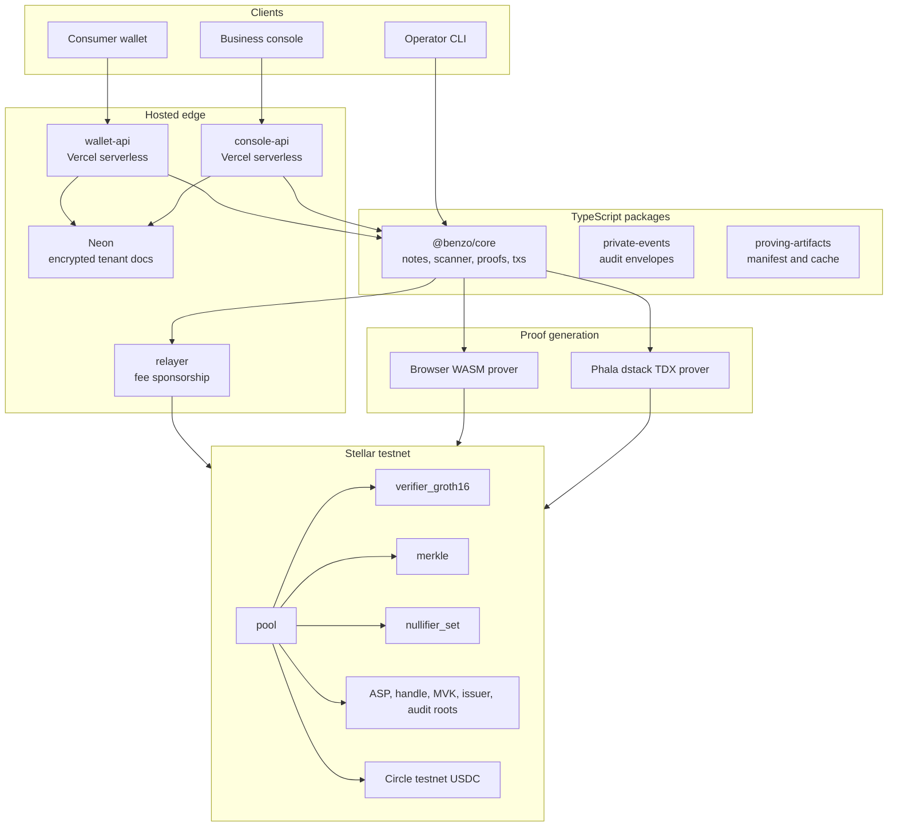

A private payment is not an API balance mutation. It is a proof-backed state
transition against the pool contract.

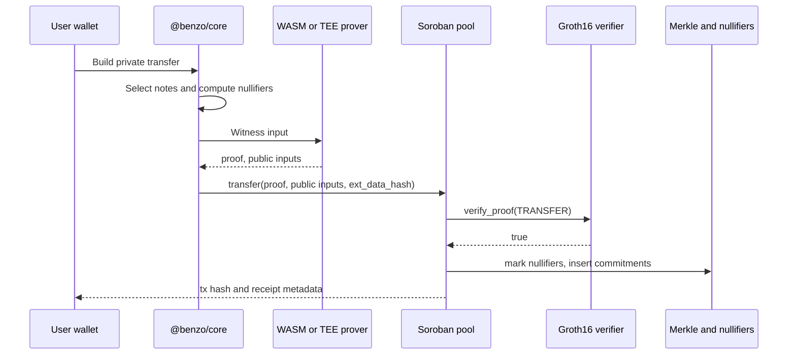

Hosted state is encrypted per tenant. The database sees document keys and
ciphertext, not wallet contacts, invoice lines, salaries, private events, or
activity contents.

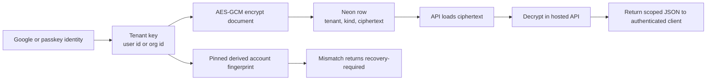

Proof routing depends on the surface and device class.

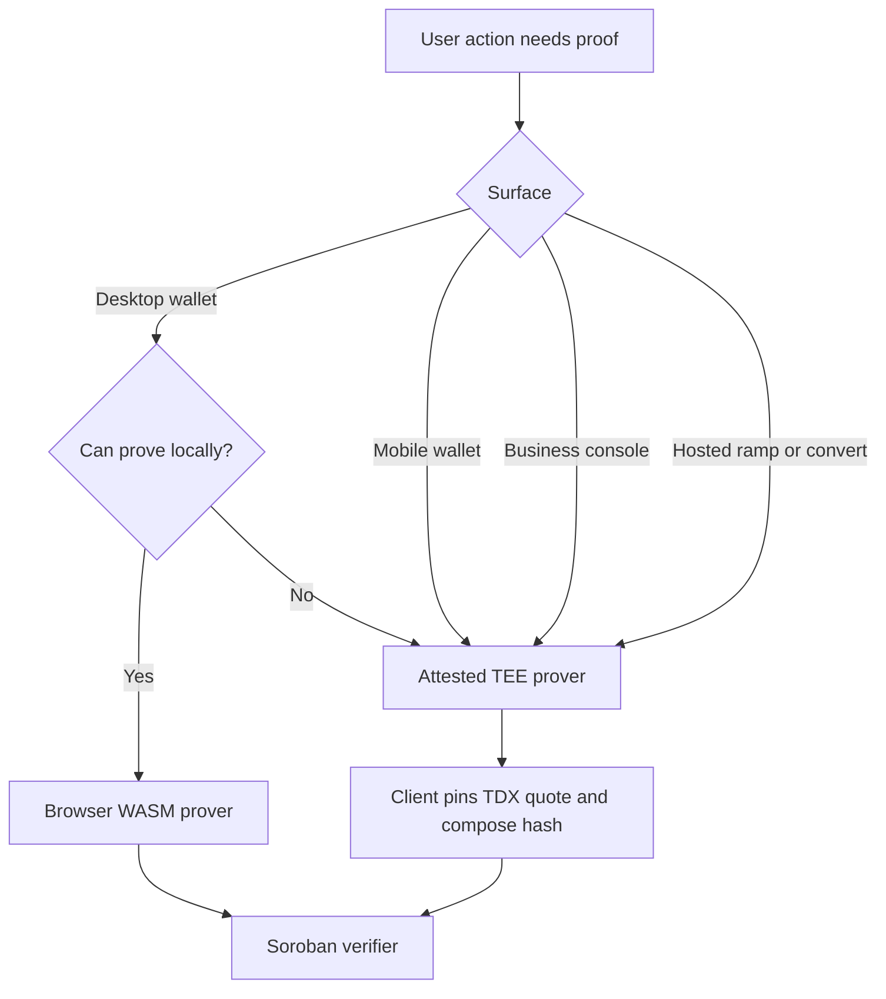

## Quickstart

Prerequisites:

- Node 20+
- pnpm 10+
- Rust toolchain from [rust-toolchain.toml](rust-toolchain.toml)
- Stellar CLI for contract deployment or live testnet flows

Install and run the standard maintainer checks:

```bash
pnpm install
pnpm lint
pnpm -r build
pnpm -r test
```

Run contract checks:

```bash
cargo fmt --all -- --check
cargo clippy --workspace --all-targets -- -D warnings
cargo test --workspace
stellar contract build
```

Replay a committed proof against the live testnet verifier. This requires no
private key, no USDC, and no proving artifact download.

```bash
node tests/replay-verify.mjs
```

Expected shape:

```text
verify_proof(ORGSUM) over the real total => true
verify_proof(ORGSUM) over a forged total => false
```

Run live testnet money movement only with funded testnet keys and verified proving
artifacts:

```bash
bash scripts/setup-testnet-env.sh
bash scripts/fetch-artifacts.sh
set -a; . ./.env; set +a
node tests/e2e/m1-flow.mjs
```

The live scripts print transaction hashes and Stellar Expert links. Never use
mainnet keys with this repository.

## Repository Layout

```text
apps/
  wallet/          Consumer wallet UI
  console/         Business console UI
  wallet-api/      Hosted wallet API
  console-api/     Hosted console API
  landing/         Public landing page
  cli/             Operator and protocol CLI

contracts/
  verifier_groth16/    BN254 Groth16 verifier and batch verifier
  pool/                Shield, transfer, unshield, org transfer
  merkle/              Poseidon2 Merkle tree
  nullifier_set/       Persistent nullifier registry
  asp_membership/      Allow-set membership and KYC admission
  asp_non_membership/  Deny-set non-membership
  org_account/         Org member roots and approval policy checks
  viewkey_anchor/      Viewing-key binding events
  audit_root/          Private audit packet root anchors
  handle_registry/     @handle registry
  ramp/                Testnet reserve/ramp contract

circuits/
  groth16/             Circom circuits
  poseidon_params/     Poseidon2 params shared by circuits, SDK, and contracts
  build/               Artifact manifest and local proving outputs

packages/
  core/                Headless SDK, note logic, scanner, prover ports, TEE routing
  proving-artifacts/   Browser artifact manifest and cache helpers
  proving-worker/      Browser worker proving adapter
  private-events/      Encrypted console audit envelopes
  relayer/             Gasless submit service
  anchor/              Self-hosted testnet anchor pieces
  indexer/             Commitment and event indexing helpers
  types/               Shared API/domain types
  ui/                  Shared UI state machines and formatters

deployments/
  testnet.json         Live contract IDs, VK IDs, provenance, TEE config

services/
  prover-enclave/      Phala dstack / Intel TDX proving service

tests/
  replay-verify.mjs    Artifact-free proof replay against the live verifier
  e2e/                 Live testnet protocol flows
```

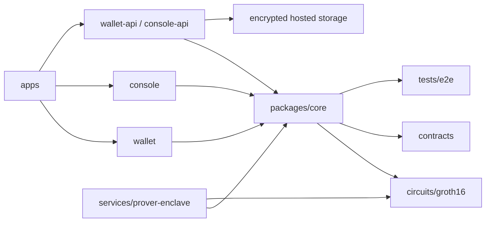

## Applications

### Consumer Wallet

The wallet provides:

- Google sign-in or device passkey onboarding
- Device-bound account derivation with no seed phrase in the UI
- Private and public USDC balances
- Add money, cash out, make public, and make private
- Private send to `@handle`
- Public send to Stellar `G...` addresses
- Deposit/import external USDC
- Request links and invite links
- Contacts, receipts, explorer links, on-chain details, and proof sharing
- Platform passkey lock support

### Business Console

The console provides:

- Google sign-in through the hosted console path
- Desktop console shell with workspace nav, command bar, notifications, approvals
- Treasury with receive QR, public send, make private, reserve proofs, solvency proofs
- Contractors, CSV import, rate cards, payment history, and payroll runs
- Payroll checks for policy, anonymous approval, computation, and funding
- Invoices, single pay, pay all, and private netting
- Grants and scoped auditor access
- Private audit packets with encrypted events, hash chain, Merkle packet, download,
  and on-chain root anchor

## Protocol

The protocol uses a shielded note model. Public USDC enters the pool as a note
commitment, moves privately by consuming nullifiers and inserting new commitments,
and exits by burning a note and releasing public USDC.

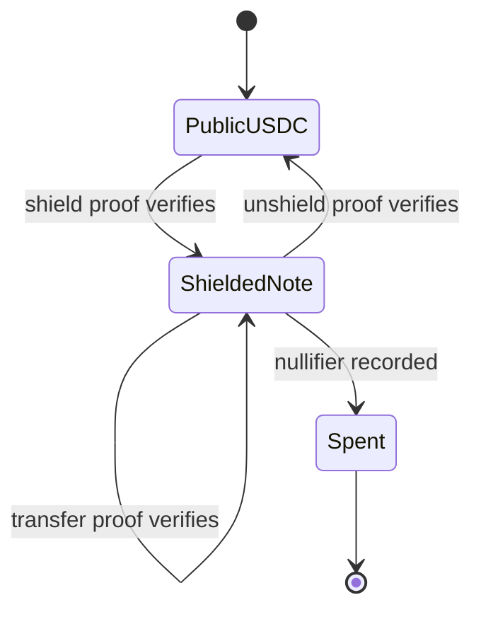

The main contracts are coordinated as follows:

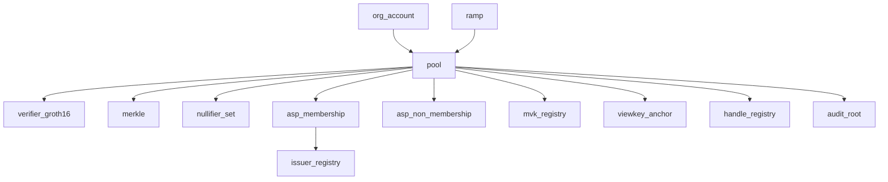

## ZK Report

### Verification Keys

The live testnet verifier has 16 registered verification keys:

`SHIELD`, `TRANSFER`, `UNSHIELD`, `SUM`, `KYC`, `FUNDS`, `BALANCE`,
`ORGAUTH`, `JSPLITORG`, `ORGSUM`, `ORGBAL`, `SPENDCAP`, `POIPAYOUT`,
`PAYCOMP`, `KYB`, `NETTING`.

Seven business-ZK keys were re-registered on the live verifier on 2026-06-23.
Their transaction hashes are recorded in [deployments/testnet.json](deployments/testnet.json)
under `provenance.vkRegistrations`.

### Proof Matrix

| User action | Circuit / proof | On-chain gate |
|---|---|---|
| Add money / shield | `SHIELD` | Deposit becomes a note only if the proof verifies |
| Private send | `TRANSFER` | Nullifiers are spent and new commitments inserted only after proof verification |
| Make public / cash out | `UNSHIELD` | Note burn and public USDC release require proof verification |
| Business private payout | `JSPLITORG` | Org notes move only with in-circuit M-of-N approval proof |
| KYC admission | `KYC` | Admission checks issuer, tier, freshness, and identity nullifier |
| Proof of balance | `BALANCE`, `ORGBAL` | Proves a threshold or funding statement without showing balances |
| Period total / auditor proof | `SUM`, `ORGSUM` | Proves a disclosed total without revealing line items |
| Payroll computation | `PAYCOMP` | Proves the run total came from the rate card |
| Spending policy | `SPENDCAP` | Proves a payout is within an approved cap |
| Compliance screening | `POIPAYOUT` | Proves a recipient is not in the deny set |
| KYB | `KYB` | Proves a business credential without revealing underlying docs |
| Private netting | `NETTING` | Proves the net amount between parties while hiding gross lines |

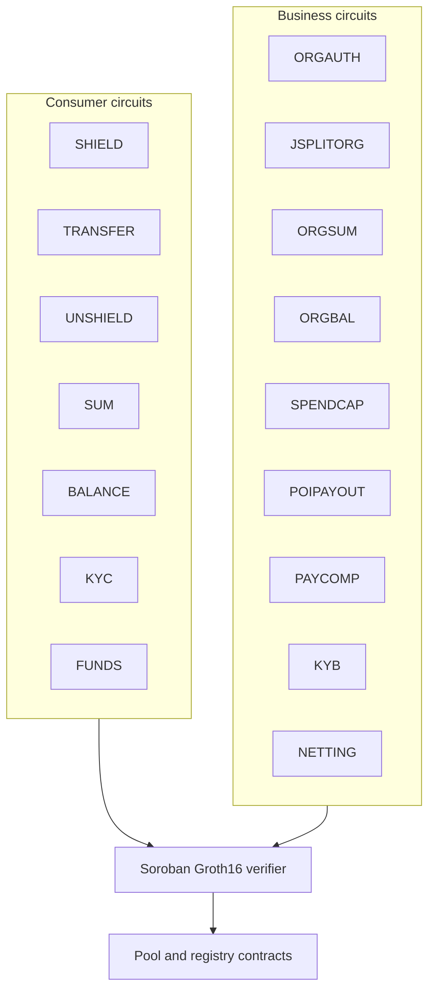

### Private Transfer

A transfer spends old notes and creates new notes. The chain sees nullifiers,
commitments, roots, proof ID, and success. It does not see the amount or private
recipient metadata.

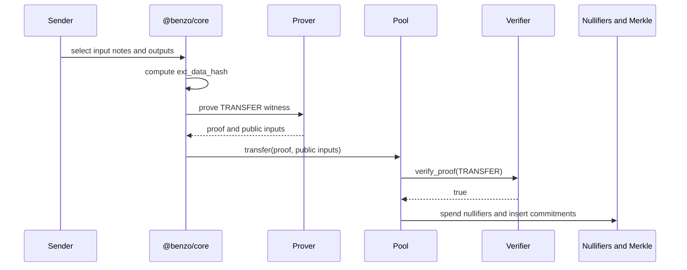

### Org Payment

Business payments use `JSPLITORG`. The approver set and threshold are enforced in
circuit, so a private org payment cannot settle unless the threshold condition is
met.

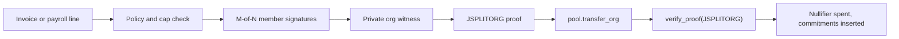

### Batched Verification

Benzo implements batched Groth16 verification for same-VK proofs. Instead of one
pairing check per proof, `verify_batch` folds N proofs into one randomized
linear-combination transcript inside the contract.

Practical result on testnet:

- `verify_batch` alone fits about 16 same-VK proofs per transaction.
- `insert_leaves` can insert about 200 leaves with subtree merging.
- The integrated `batch_transfer_org` path is settlement-bound at about 3 org
  spends per transaction because it also writes nullifiers, viewing-key bindings,
  and Merkle leaves.

That is batched verification, not recursion. It gives a real bounded win without
claiming thousands of payments per proof.

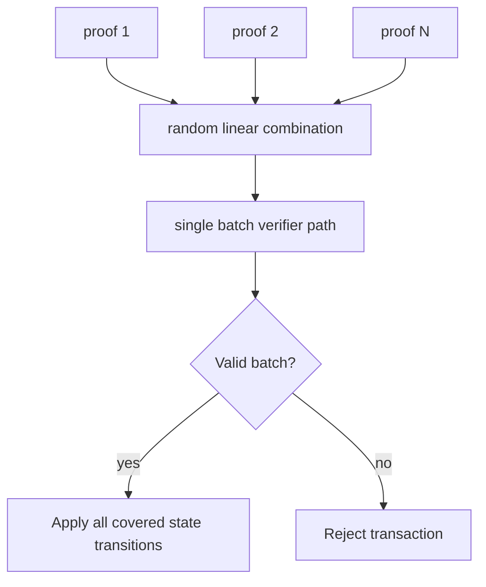

### Poseidon2 Parity

Commitments, nullifiers, tree nodes, and registry leaves depend on Poseidon2. The
parameterization must remain byte-identical across Circom, TypeScript, and the
Soroban host implementation.

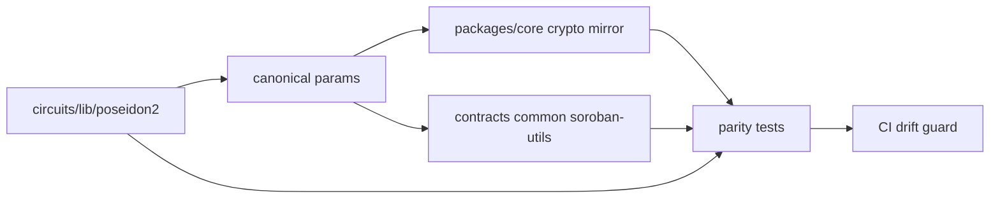

## Privacy And Auditability

The public chain sees commitments, nullifiers, Merkle roots, verification key IDs,
and successful proof checks. It does not see the private amount, recipient handle,
invoice line, salary, approver comment, or business memo.

Private business records are encrypted before they become hosted state:

- Wallet and console APIs persist tenant documents in Neon as AES-GCM ciphertext.
- Wallet documents are scoped to the authenticated user.
- Console documents are scoped to the authenticated org or workspace.
- A fresh Google or passkey account starts with zero balance, empty contacts,
  empty activity, and no seeded console objects.
- Tenant documents pin the first derived account fingerprint.
- If the same identity later derives a different account, the API returns a
  recovery-required error instead of silently reusing old state.
- Console private events are stored as encrypted envelopes.
- Each private event commits to the previous one, making the packet tamper-evident.
- The console anchors only packet/root metadata to `audit_root`.

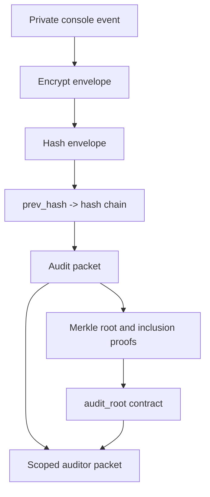

Hosted operational state is tenant-persistent too: invites, onboarding,
private-event envelopes, proof receipts, idempotency records, and rate-limit
buckets survive serverless cold starts. Write endpoints accept `Idempotency-Key`.
The same key and same body replay the original JSON result, while the same key
with a different body fails with `409`.

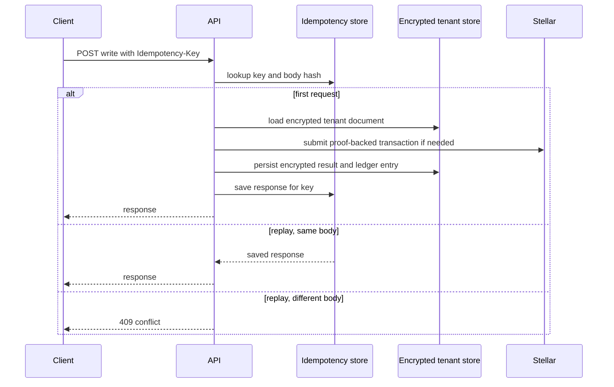

## Testing

Standard checks:

```bash
pnpm lint
pnpm -r build
pnpm -r test
```

ZK artifact check:

```bash
pnpm test:zk
```

Production guard checks:

```bash
pnpm audit:prod-env
pnpm audit:privacy
pnpm audit:actions
```

Contract checks:

```bash
cargo fmt --all -- --check
cargo clippy --workspace --all-targets -- -D warnings
cargo test --workspace
```

Live protocol checks:

```bash
node tests/e2e/tee-onchain.mjs
node tests/e2e/joinsplit-org-settle-onchain.mjs
node tests/e2e/payroll-computation-onchain.mjs
node tests/e2e/cross-netting-onchain.mjs
node tests/e2e/kyb-credential-onchain.mjs
```

## Deployment And Operations

The live testnet deployment is recorded in [deployments/testnet.json](deployments/testnet.json).
It includes contract IDs, verification key IDs, provenance, and the TEE endpoint
metadata consumed by the clients.

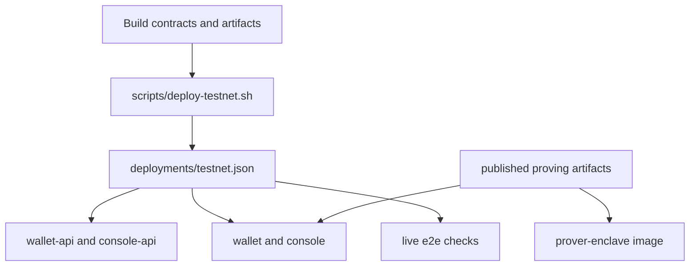

Production hosted APIs require:

- `DATABASE_URL`
- `BENZO_DATA_ENCRYPTION_SECRET`
- `BENZO_ACCOUNT_SALT` or `BENZO_AUTH_SALT`
- Google OAuth client ID for hosted login
- Stellar RPC and deployment config
- TEE endpoint and measurement where delegated proving is required

The API production guards reject missing live configuration instead of falling
back to seeded data.

## Security Status

Benzo is unaudited. Do not use it with mainnet funds.

Known limits:

- Admin governance is still a single deployer key. Mainnet needs Stellar multisig
  and timelocked verification-key rotation.
- Privacy improves with anonymity-set size. A fresh testnet pool is small.
- `proof_of_sum` proves the disclosed notes sum to a total. It does not prove the
  holder did not omit another note unless the authorized viewing-key set is
  complete.
- `FUNDS` is oracle-backed and should be read as proof of a signed balance claim,
  not pure note ownership.
- Hosted storage is encrypted document-per-tenant storage. Mainnet should split
  reserve accounting, audit events, proof receipts, and product objects into
  normalized tables with migration tooling.
- Reserve accounting records on-chain testnet reserve flow, derived balances, and
  failed attempts. Mainnet needs reconciliation jobs and settlement failure
  operations before any real fiat partner is connected.
- Account recovery fails closed today. If Google account, passkey, or salt changes,
  the API blocks access with a recovery-required response. A self-serve recovery
  or migration path is future work.

## License

Apache-2.0.
