# Benzo

Benzo is a shielded USDC protocol on Stellar. It uses Soroban contracts and
Groth16 proofs to move USDC through a private note pool while keeping selected
facts auditable through zero-knowledge proofs and scoped disclosures.

The repository includes the contracts, circuits, TypeScript SDK, hosted APIs, and
two reference apps. The README focuses on the protocol: what is proven, what is
stored on-chain, what is private, and where the ZK boundary sits.

> Status: Stellar testnet, unaudited, not mainnet software.
> Repository note: early local commit dates were normalized before public release
> after correcting bad local metadata.

## Links

| Resource | URL |
|---|---|
| Wallet | [wallet.benzo.space](https://wallet.benzo.space) |
| Console | [console.benzo.space](https://console.benzo.space) |
| Verifier contract | [CCBR2Y3ZAD75UFLZSED3NJYZDYIYZIGIEMZO6BQ45Y2NQBWPJ7MXKXYB](https://stellar.expert/explorer/testnet/contract/CCBR2Y3ZAD75UFLZSED3NJYZDYIYZIGIEMZO6BQ45Y2NQBWPJ7MXKXYB) |
| Privacy pool | [CB4VS4OCF6HEGCLSPM4E3ILNGP4KF5ZJ7JEXUJIJBUU5IZC2VPDVSJOT](https://stellar.expert/explorer/testnet/contract/CB4VS4OCF6HEGCLSPM4E3ILNGP4KF5ZJ7JEXUJIJBUU5IZC2VPDVSJOT) |
| Deployment record | [deployments/testnet.json](deployments/testnet.json) |

Network: Stellar testnet. Asset: Circle testnet USDC. Proof system: Groth16 over
BN254. Hashing: Poseidon2 with parity guards across Circom, TypeScript, and
Soroban host functions.

## VPS Deployment

The VPS deployment uses Docker Compose behind Caddy. Put production values in
`/opt/benzo/.env` on the server and deploy from `deploy/vps` with:

```sh
sudo ./deploy.sh
```

Use the script rather than a plain `docker compose build`. The API containers use
`env_file`, but the static wallet and console bundles also need build-time values
for Google sign-in. `deploy.sh` passes `/opt/benzo/.env` through Compose so
runtime env and frontend build args stay in sync.

## Product Conviction

Stablecoins are already fast, global, and programmable. The missing piece for
ordinary users and businesses is privacy that feels normal. Benzo is built around
the idea that private money should not feel like a crypto tool. It should feel
like a modern payments app, with handles, receipts, requests, invoices, payroll,
and audit exports, while the cryptography runs underneath.

The user experience is intentionally web2-like: sign in, see a balance, send,
request, pay, approve, export. The protocol underneath keeps the parts that should
be private out of public chain state, then lets the user or business prove the
specific fact someone needs to know.

That product line is the core bet:

- people should be able to hold and send digital dollars without publishing a
  permanent payment graph;
- companies should be able to pay teams, vendors, and contractors without making
  salaries and commercial relationships public;
- auditors and counterparties should get verifiable evidence, not blind trust and
  not full internal ledgers;
- compliance should be provable at the edges without turning every transfer into
  public surveillance data.

## Product Surface

Benzo ships two reference apps over the same shielded-USDC core.

### Wallet

The wallet is the consumer surface for private USDC.

- Google or passkey onboarding
- Device-bound account derivation without seed phrases in the UI
- Private and public USDC balances
- Add money from the testnet reserve into the private pool
- Cash out from private balance back to the testnet reserve
- Make public and make private
- Private send to a `@handle`
- Public send to any valid Stellar `G...` address
- Deposit/import external USDC
- Request links and invite links
- Contacts, receipts, on-chain details, explorer links, and proof sharing
- Platform passkey lock support where the device supports WebAuthn/passkeys

### Console

The console is the business surface for private stablecoin operations.

- Google sign-in through the hosted console path
- Treasury with private and public balances, receive QR, public send, make private,
  reserve proofs, solvency proofs, and on-chain details
- Contractors, CSV import, rate cards, payment history, and payroll runs
- Payroll checks for policy, anonymous approval, computation, and funding
- Invoices, single pay, pay all, and private netting
- Grants and scoped auditor access
- Private audit packets with encrypted events, hash chain, Merkle packet,
  downloadable packet, and on-chain root anchor
- Workspace navigation, command bar, notifications, and approvals

The wallet and console are reference products, but they are not separate
protocols. Both use the same contracts, proof system, note model, and SDK.

## Design Goals

Benzo optimizes for regulated privacy rather than anonymity at all costs.

- Amounts and counterparties should not be readable from public chain state.
- Every private spend must still satisfy value conservation, ownership,
  nullifier uniqueness, and Merkle membership.
- Compliance checks should happen at the edges without putting private payment
  details on-chain.
- Businesses should be able to prove solvency, period totals, payroll computation,
  spending policy, KYB status, and private netting facts without disclosing the
  underlying ledger.
- Auditors should receive scoped evidence packets instead of global plaintext
  access.
- Production paths should fail closed if proofs, live config, auth, encrypted
  storage, or idempotency are missing.

## ZK Integration Summary

A private payment in Benzo is a proof-backed state transition. The API or UI can
prepare a transaction, but the pool contract only changes state after the Soroban
verifier accepts the proof.

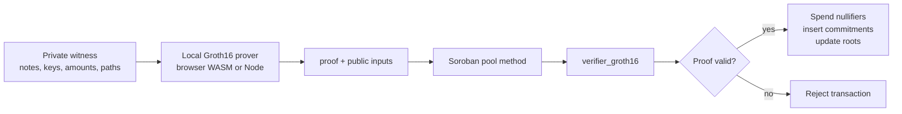

The public chain records commitments, nullifiers, roots, verification key IDs,
and successful verification. It does not record private amounts, handles,
salaries, invoice details, approval comments, or business memos.

## Proof System Decisions

### Groth16 on Stellar BN254

Benzo uses Groth16 because Stellar exposes BN254 host functions, making on-chain
verification practical inside Soroban contracts. Verification keys are registered
in `verifier_groth16` under stable IDs.

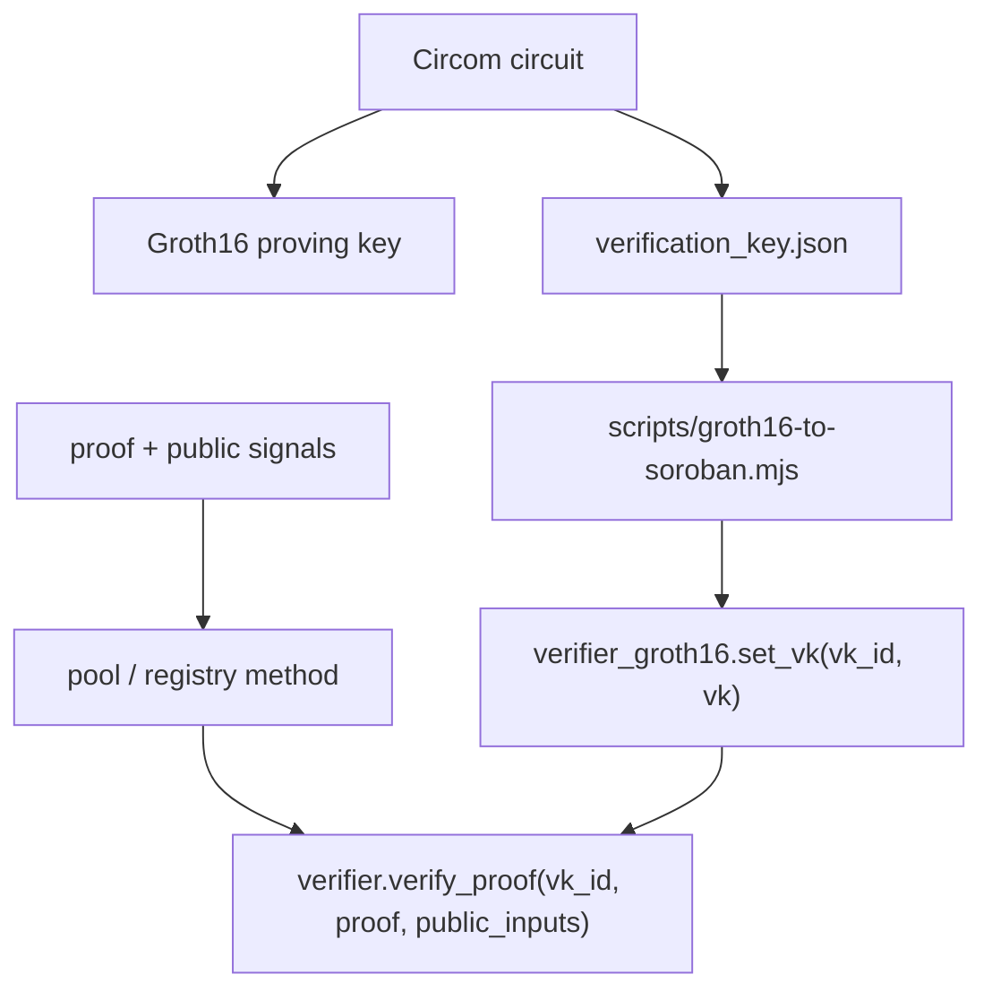

Live testnet VK IDs:

`SHIELD`, `TRANSFER`, `UNSHIELD`, `SUM`, `KYC`, `FUNDS`, `BALANCE`,
`ORGAUTH`, `JSPLITORG`, `ORGSUM`, `ORGBAL`, `SPENDCAP`, `POIPAYOUT`,
`PAYCOMP`, `KYB`, `NETTING`.

### Poseidon2 Everywhere

Commitments, nullifiers, Merkle nodes, ASP leaves, MVK registry leaves, and org
note primitives use Poseidon2. A one-byte parameter drift would make notes
unspendable, so parity is treated as a release gate.

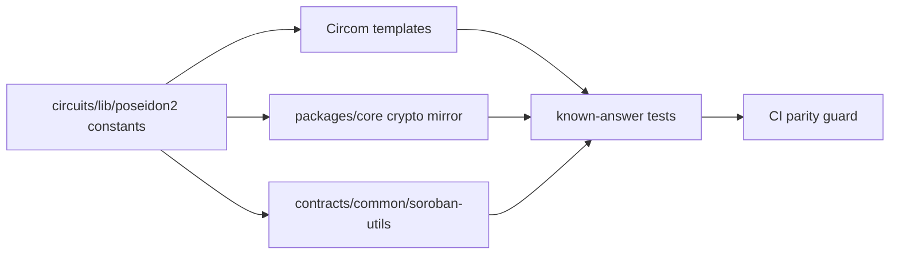

### Notes, Nullifiers, And Commitments

Benzo follows a note model. A shield creates commitments, a private transfer
spends old notes through nullifiers and creates new commitments, and an unshield
burns a note to release public USDC.

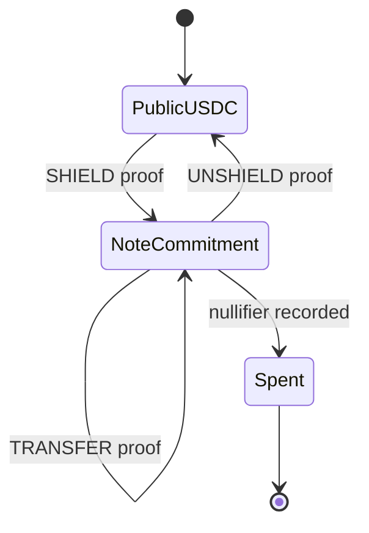

Key invariants:

- Nullifiers live in persistent contract storage.
- Field-element encoding fails loud rather than truncating.
- Value conservation is enforced in circuit.
- Merkle membership is proven before a note can be spent.
- Output commitments are derived from private note data and public domain tags.

## Circuit Matrix

| Circuit | Purpose | Private witness | Public claim |
|---|---|---|---|
| `SHIELD` | Public USDC into private note | depositor scalar, amount, blinding, Merkle data, MVK data | commitment is valid and depositor is allowed |
| `TRANSFER` | Private note to private note | input notes, spend keys, output amounts, paths | nullifiers and commitments are valid, value conserved |
| `UNSHIELD` | Private note to public USDC | input note, spend key, path, deny-set proof | withdrawal is valid and not denied |
| `SUM` | Consumer period/exact total proof | owned notes | disclosed total is correct for provided notes |
| `BALANCE` | Consumer threshold proof | owned notes | balance meets threshold |
| `KYC` | Admission credential | issuer-signed credential | tier/freshness/issuer membership hold |
| `FUNDS` | Oracle-backed funds claim | signed balance attestation | threshold is satisfied by signed claim |
| `ORGAUTH` | Anonymous org approval | member signatures and Merkle path | threshold approval holds |
| `JSPLITORG` | Confidential org spend | org note, member signatures, output notes | org note spend is authorized and value-conserving |
| `ORGSUM` | Org exact total | org notes | disclosed total is correct for provided org notes |
| `ORGBAL` | Org threshold proof | org notes | treasury meets threshold |
| `SPENDCAP` | Spending policy | payout amount, cap witness | payout is within approved cap |
| `POIPAYOUT` | Recipient screening | recipient data and deny-set path | recipient is not in deny set |
| `PAYCOMP` | Payroll computation | rate card and line items | run total matches private computation |
| `KYB` | Business credential | issuer-signed business credential | business status/jurisdiction/tier hold |
| `NETTING` | Private invoice netting | gross invoice lines | net amount is correct |

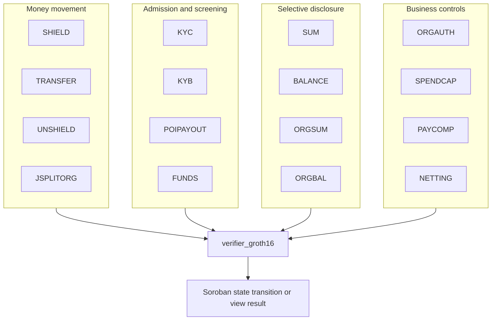

## Money Movement Proofs

### Shield

Shielding turns public testnet USDC into a private note. The proof binds the
public deposit to a valid note commitment and the allow-list admission root.

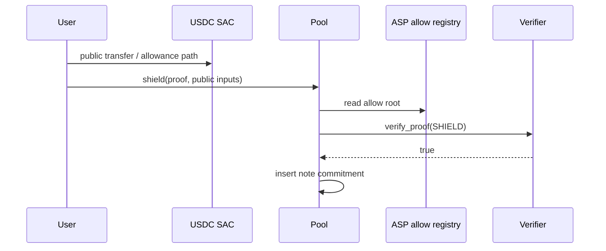

### Transfer

A private transfer consumes nullifiers and inserts new note commitments. The
recipient, amount, and note plaintext are never public chain fields.

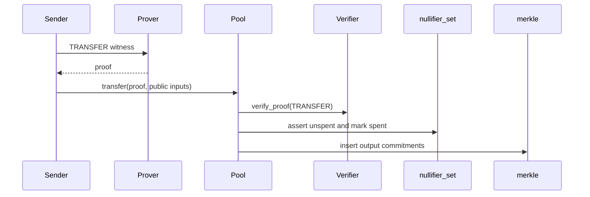

### Unshield

Unshielding releases public USDC only if the note spend is valid and the note is
not in the deny set.

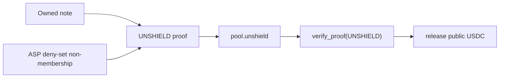

## Business Proofs

Business flows use the same private note machinery plus org-specific constraints.
The central design choice is that approval, policy, and computation are proved
before settlement instead of being trusted as API state.

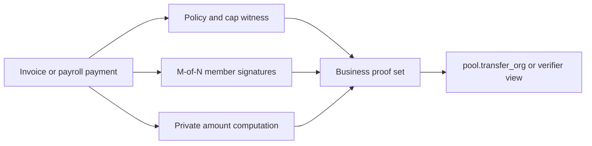

### M-of-N Org Spend

`JSPLITORG` proves that an org note is spent with enough valid member signatures.
The chain verifies the threshold condition without learning which internal
business workflow produced the payment.

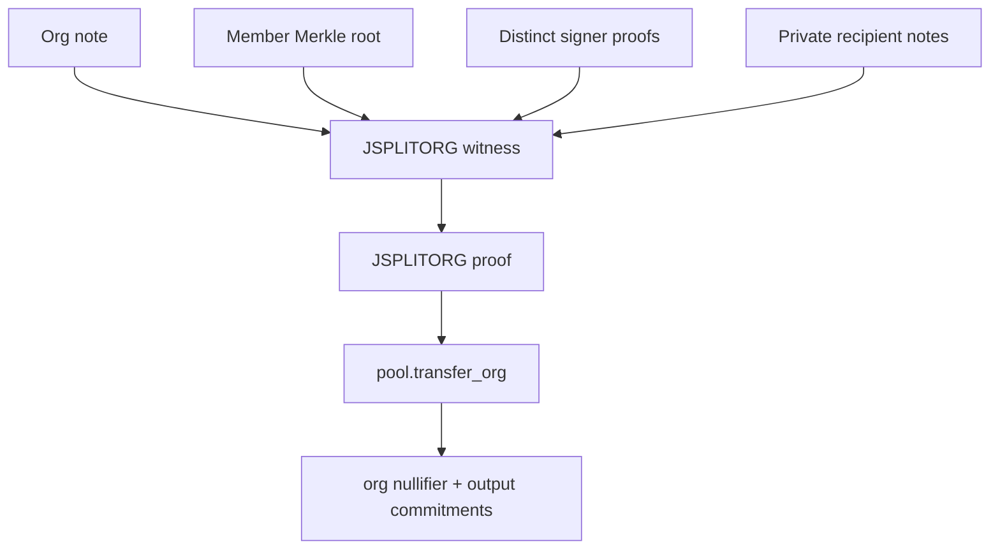

### Payroll Computation

`PAYCOMP` proves a payroll total was derived from a private rate card and private
line items. The proof can expose the run total without exposing individual salaries.

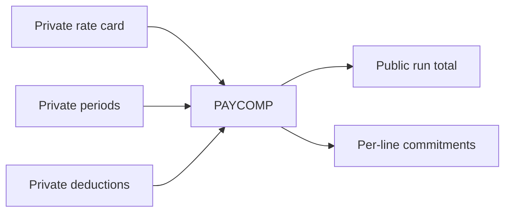

### Private Netting

`NETTING` proves the net payable amount between entities while hiding gross invoice
lines.

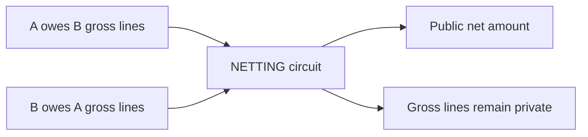

## Compliance And Selective Disclosure

Benzo keeps compliance at the edges and facts in proofs. It does not rely on
publicly publishing the user's payment graph.

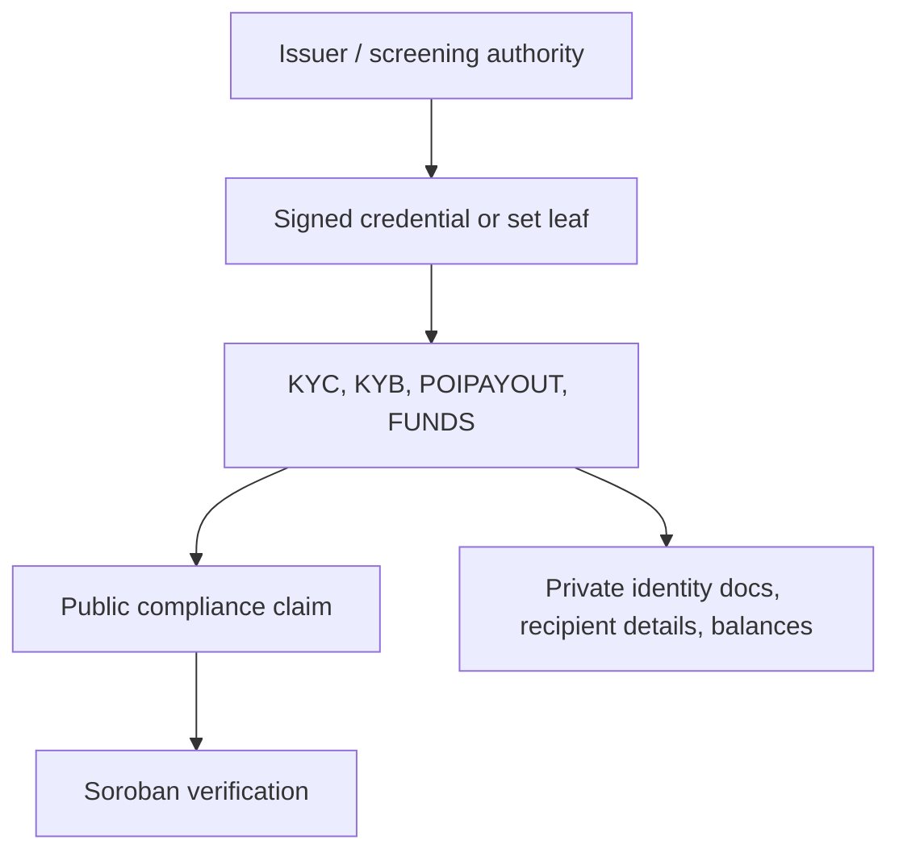

Selective disclosure uses viewing-key and audit-packet style evidence rather than
making the chain a plaintext business ledger.

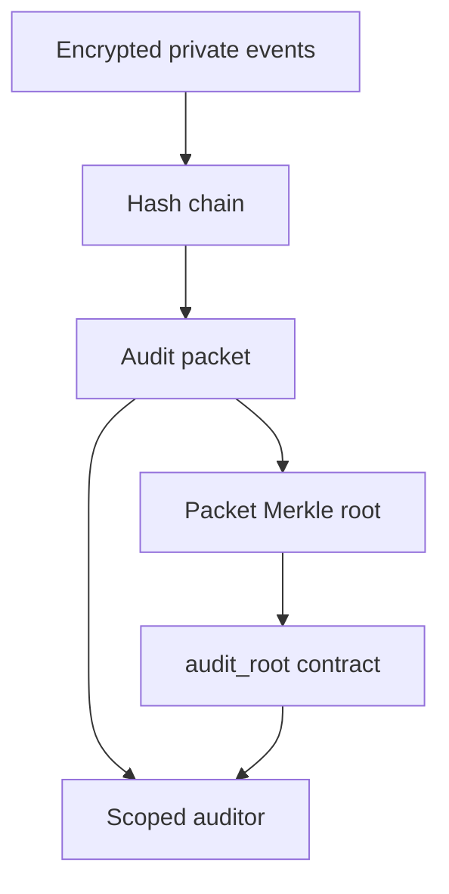

## Proving Location

Benzo is local-only for proving. Wallet proofs use the browser/on-device WASM
prover when the account is device-held. Hosted API and console proof work uses
the local Node proving runtime inside the Benzo service. The product does not
send private witnesses to outside proving services.

| Surface | Proving path |
|---|---|
| Capable desktop wallet | Browser WASM prover |
| Mobile wallet or weak device | Local-only; heavy proof actions fail clearly or ask for a capable device |
| Business console | Local Node prover in the console runtime |
| Hosted ramp or convert flow | Local Node prover in the hosted API runtime |

The prover location never replaces ZK soundness. Proofs still verify on-chain.
The local-only rule is about witness custody: private amounts, note keys, and
business ledger facts are not sent to a third-party proving endpoint.

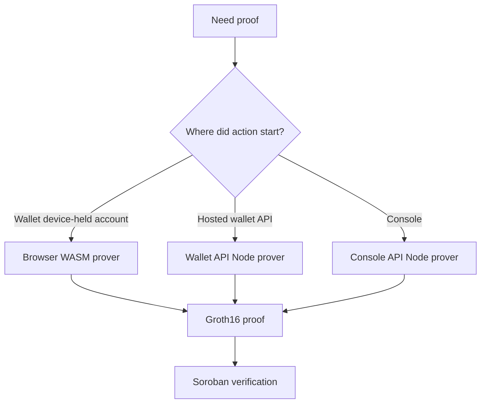

## Batched Verification

Benzo implements batched Groth16 verification for same-VK proofs. `verify_batch`
folds N proofs into one randomized linear-combination transcript inside the
contract.

Practical result on testnet:

- `verify_batch` alone fits about 16 same-VK proofs per transaction.
- `insert_leaves` can insert about 200 leaves with subtree merging.
- The integrated `batch_transfer_org` path is settlement-bound at about 3 org
  spends per transaction because it also writes nullifiers, viewing-key bindings,
  and Merkle leaves.

This is batched verification, not recursion. It gives a bounded on-chain win
without claiming thousands of payments per proof.

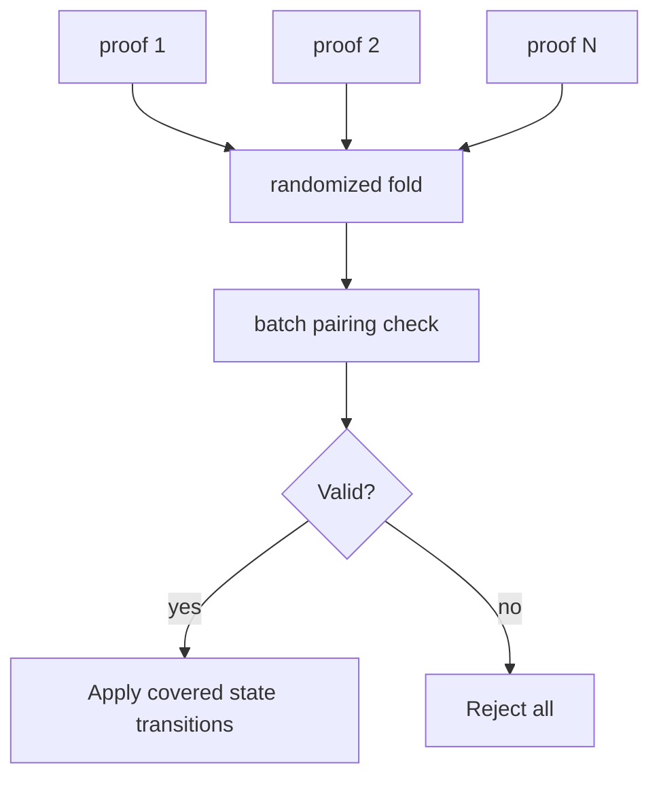

## On-Chain Storage Model

The protocol stores the public data needed to prevent double spends and verify
future proofs. It does not store private note plaintext.

| Data | Location | Privacy impact |
|---|---|---|
| Verification keys | `verifier_groth16` | public |
| Commitments | `merkle` / pool events | hides note plaintext |
| Nullifiers | `nullifier_set` / pool storage | prevents double spend, unlinkable without witness |
| ASP roots | ASP registry contracts | public compliance set roots |
| MVK roots | MVK registry | public viewing-key authorization roots |
| Audit roots | `audit_root` | public commitment to private packet |
| Tenant documents | Neon ciphertext | off-chain encrypted product state |

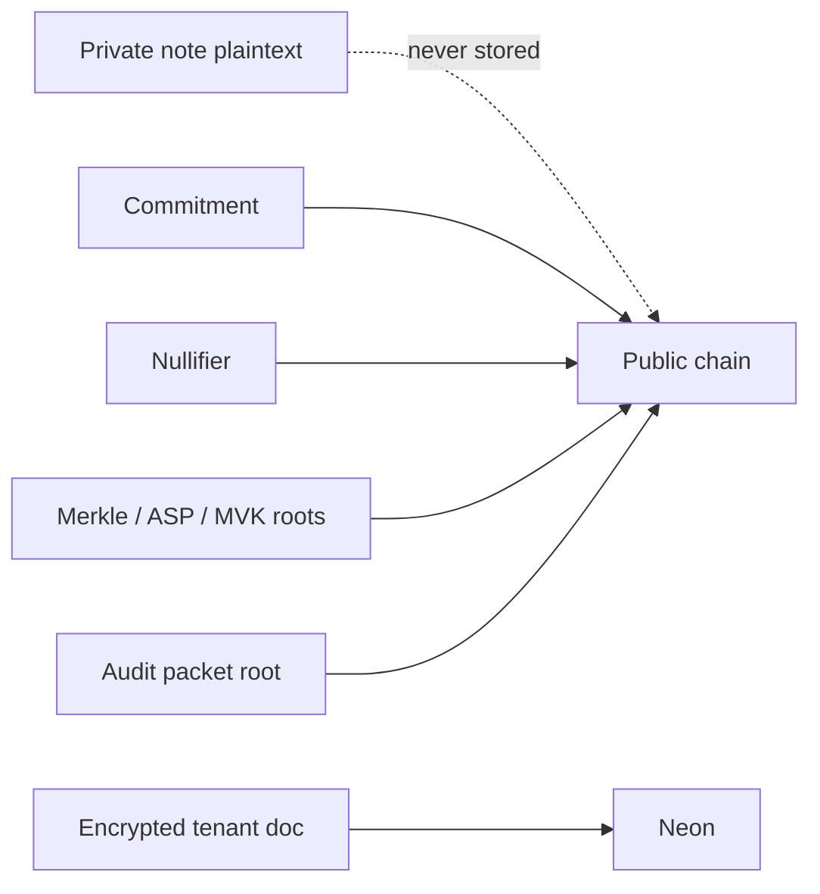

## Test And Verification

Artifact-free verifier replay:

```bash
pnpm install
node tests/replay-verify.mjs
```

Standard maintainer checks:

```bash
pnpm lint
pnpm -r build
pnpm -r test
```

ZK artifact-backed tests:

```bash
bash scripts/fetch-artifacts.sh
pnpm test:zk
```

Production guard checks:

```bash
pnpm audit:prod-env
pnpm audit:privacy
pnpm audit:actions
```

Contract checks:

```bash
cargo fmt --all -- --check
cargo clippy --workspace --all-targets -- -D warnings
cargo test --workspace
stellar contract build
```

Focused live checks:

```bash
set -a; . ./.env; set +a
node tests/e2e/m1-flow.mjs
node tests/e2e/joinsplit-org-settle-onchain.mjs
node tests/e2e/payroll-computation-onchain.mjs
node tests/e2e/cross-netting-onchain.mjs
node tests/e2e/kyb-credential-onchain.mjs
```

## Repository Layout

```text
contracts/                  Soroban contracts
circuits/groth16/           Circom circuits
circuits/poseidon_params/   Shared Poseidon2 params
packages/core/              Headless SDK, note logic, scanner, prover ports
packages/proving-artifacts/ Browser artifact manifest and cache helpers
packages/proving-worker/    Browser worker proving adapter
packages/private-events/    Encrypted audit envelopes
apps/wallet/                Reference consumer wallet
apps/console/               Reference business console
apps/wallet-api/            Hosted wallet API
apps/console-api/           Hosted console API
tests/e2e/                  Live testnet protocol checks
deployments/testnet.json    Live contract IDs and VK IDs
```

## Security Status

Benzo is unaudited. Do not use it with mainnet funds.

Known limits:

- Admin governance is still a single deployer key. Mainnet needs Stellar multisig
  and timelocked verification-key rotation.
- Privacy improves with anonymity-set size. A fresh testnet pool is small.
- `proof_of_sum` proves the disclosed notes sum to a total. It does not prove the
  holder did not omit another note unless the authorized viewing-key set is
  complete.
- `FUNDS` is oracle-backed and should be read as proof of a signed balance claim,
  not pure note ownership.
- Hosted storage is encrypted document-per-tenant storage. Mainnet should split
  reserve accounting, audit events, proof receipts, and product objects into
  normalized tables with migration tooling.
- Reserve accounting records on-chain testnet reserve flow, derived balances, and
  failed attempts. Mainnet needs reconciliation jobs and settlement failure
  operations before any real fiat partner is connected.
- Account recovery fails closed today. If Google account, passkey, or salt changes,
  the API blocks access with a recovery-required response. A self-serve recovery
  or migration path is future work.

## License

Apache-2.0.
