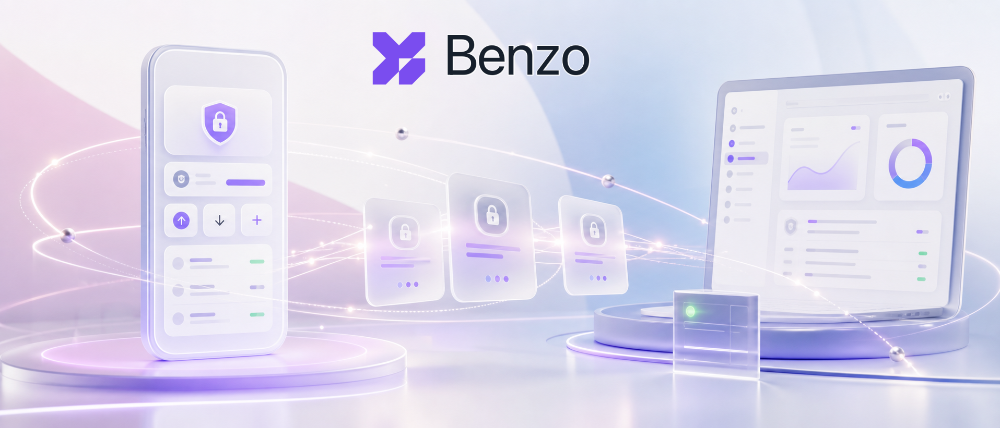
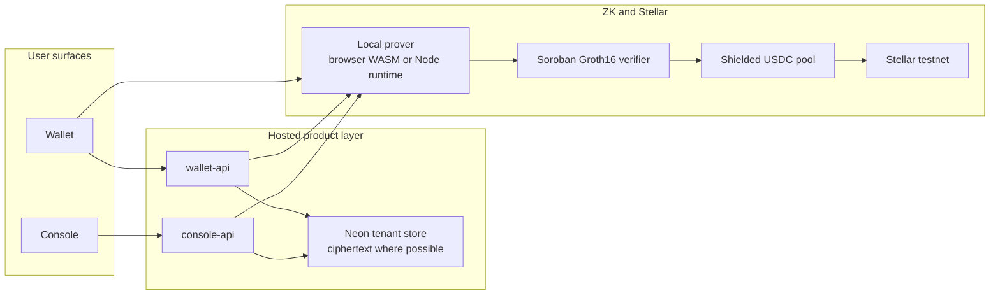
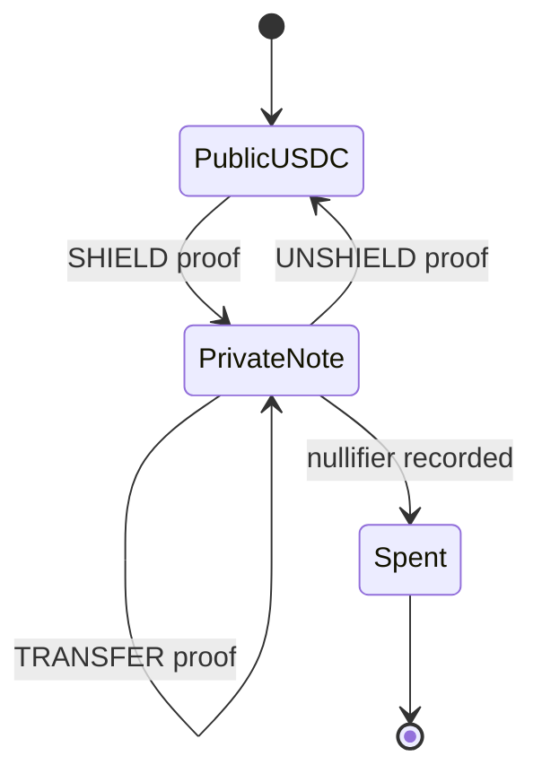
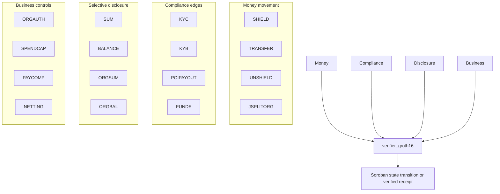
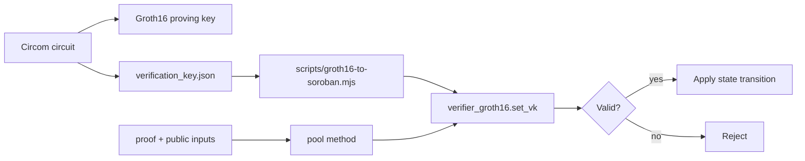
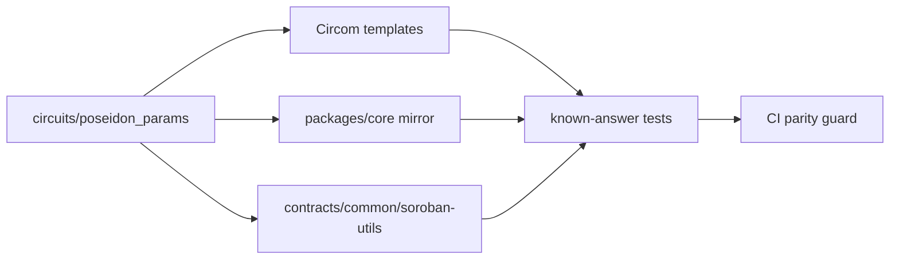
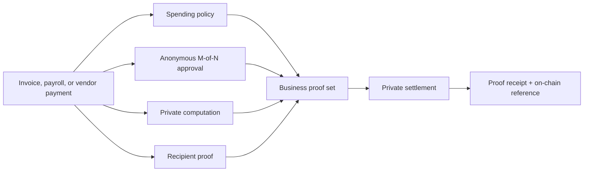
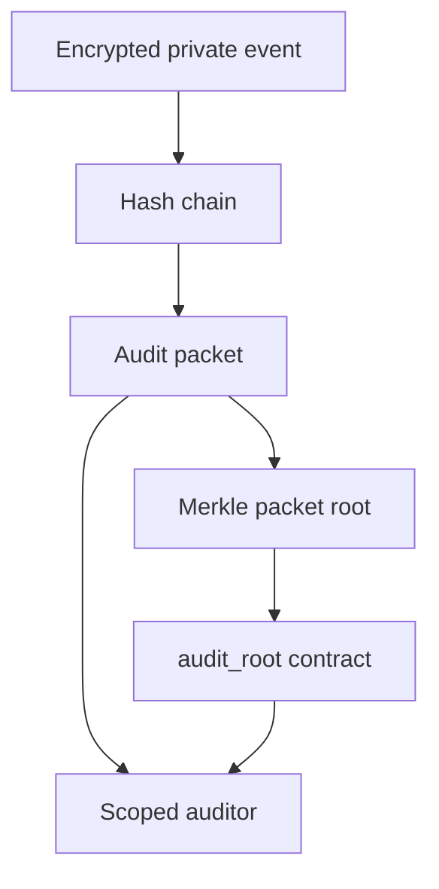

<h1 align="center">
  
</h1>

<p align="center">
  
</p>

<p align="center">
  <strong>Private USDC payments on Stellar.</strong><br />
  A normal payments wallet and business finance console, with zero-knowledge
  proofs keeping balances, transfers, payroll, invoices, and audit packets
  private by default.
</p>

<p align="center">
  <a href="https://wallet.benzo.space">Wallet</a> |
  <a href="https://console.benzo.space">Console</a> |
  <a href="deployments/testnet.json">Testnet deployment</a> |
  <a href="SECURITY.md">Security</a>
</p>

## What Benzo Is

Benzo is a shielded-USDC protocol and product shell for Stellar Soroban. It is
built around a simple conviction: stablecoin payments should feel familiar, but a
public chain should not become a permanent map of a person's income, salary,
vendors, customers, and cash flow.

The repository contains:

- Soroban contracts for the private pool, verifier, nullifier set, Merkle tree,
  handle registry, request registry, audit root, ramp, and organization account.
- Groth16 circuits for consumer transfers, business payments, credentials,
  payroll computation, invoice netting, reserves, and selective disclosure.
- TypeScript SDK packages for notes, proving, scanning, account derivation,
  Stellar transactions, links, audit packets, and integrations.
- Hosted wallet and console APIs backed by tenant-scoped encrypted storage.
- Reference wallet, console, and landing apps.

The current public deployment runs on Stellar testnet with Circle testnet USDC.
Commercial fiat partners are not connected; the cash-in/cash-out corridor uses a
self-hosted testnet reserve and anchor path.

## Product

### Wallet

The wallet is the consumer surface for private USDC.

- Google or passkey onboarding.
- Device-bound account derivation with no seed phrase in the default UI.
- Private and public USDC balances.
- Add money, cash out, make private, and make public.
- Private send to `@handles`.
- Public send to any valid Stellar `G...` address.
- Deposit/import external USDC.
- Request links and invite links.
- Contacts, notifications, receipts, explorer links, and proof sharing.
- Lock support through WebAuthn/passkeys where the device supports it.

### Console

The console is the business surface for private stablecoin operations.

- Workspace dashboard, command bar, notifications, and approvals.
- Treasury with public receive, public send, make private, reserve proofs,
  solvency proofs, QR/address copy, and on-chain detail views.
- Contractors, CSV import, rate cards, payment history, and payroll runs.
- Payroll checks for policy, anonymous approval, private computation, and
  funding.
- Invoices, single pay, pay all, and private netting.
- Auditor grants, KYB proofs, period-total attestations, and downloadable
  attestations.
- Private audit packets with encrypted events, hash-chain integrity, Merkle
  packet roots, downloadable packets, and on-chain root anchoring.

The wallet and console are separate apps over the same protocol. They share the
same contracts, proof system, note model, and tenant isolation rules.

## How It Works



The chain sees commitments, nullifiers, Merkle roots, verification-key IDs,
audit roots, and successful verification. It does not see private note plaintext,
private amounts, handles, salaries, invoice lines, approval comments, or business
memos.

## Privacy Model

Benzo uses a note model:

1. Public USDC is shielded into a private note commitment.
2. A private transfer spends old notes by publishing nullifiers.
3. New notes are inserted as commitments.
4. An unshield spends a note and releases public USDC.



Core invariants:

- Nullifiers are stored in persistent Soroban storage.
- Field-element encoding fails loud rather than truncating.
- Value conservation is enforced in-circuit.
- Merkle membership is proven before a note can be spent.
- Output commitments are derived from private note data and public domain tags.
- Proof actions fail closed if proving or verification cannot complete.

## ZK Circuits

| Circuit | Purpose | Private witness | Public claim |
|---|---|---|---|
| `SHIELD` | Public USDC into a private note | depositor scalar, amount, blinding, Merkle data, MVK data | note commitment is valid |
| `TRANSFER` | Private note to private note | input notes, spend keys, output amounts, paths | nullifiers and commitments are valid, value is conserved |
| `UNSHIELD` | Private note to public USDC | input note, spend key, path, deny-set proof | withdrawal is valid and not denied |
| `SUM` | Consumer total proof | owned notes | disclosed total is correct |
| `BALANCE` | Consumer threshold proof | owned notes | balance meets threshold |
| `KYC` | Admission credential | issuer-signed credential | tier, freshness, and issuer membership hold |
| `FUNDS` | Funds attestation | signed balance claim | threshold is satisfied |
| `ORGAUTH` | Anonymous org approval | member signatures and Merkle path | threshold approval holds |
| `JSPLITORG` | Confidential org spend | org note, member signatures, output notes | org spend is authorized and value-conserving |
| `ORGSUM` | Org exact total | org notes | disclosed total is correct |
| `ORGBAL` | Org threshold proof | org notes | treasury meets threshold |
| `SPENDCAP` | Spending policy | payout amount, cap witness | payout is within approved cap |
| `POIPAYOUT` | Recipient screening | recipient data and deny-set path | recipient is not in deny set |
| `PAYCOMP` | Payroll computation | rate card and line items | payroll total matches private computation |
| `KYB` | Business credential | issuer-signed business credential | business status, jurisdiction, and tier hold |
| `NETTING` | Private invoice netting | gross invoice lines | net amount is correct |



## Proof System Decisions

### Groth16 On Stellar BN254

Benzo uses Groth16 because Stellar exposes BN254 host functions, making on-chain
verification practical inside Soroban. Verification keys are registered in
`verifier_groth16` under stable IDs.



Live testnet verification-key IDs:

`SHIELD`, `TRANSFER`, `UNSHIELD`, `SUM`, `KYC`, `FUNDS`, `BALANCE`,
`ORGAUTH`, `JSPLITORG`, `ORGSUM`, `ORGBAL`, `SPENDCAP`, `POIPAYOUT`,
`PAYCOMP`, `KYB`, `NETTING`.

### Poseidon2 Everywhere

Commitments, nullifiers, Merkle nodes, ASP leaves, MVK registry leaves, and org
note primitives use Poseidon2. Parity across circuit code, TypeScript, and
Soroban is a release gate.



### Local-Only Proving

Benzo does not send private witnesses to third-party proving services. Wallet
proofs use the browser/on-device proving path where available. Hosted wallet API
and console proof work use the local Node proving runtime inside the Benzo
service.

| Surface | Proving path |
|---|---|
| Capable desktop wallet | Browser WASM prover |
| Mobile wallet or weak device | Heavy proof actions fail clearly or ask for a capable device |
| Hosted wallet API | Local Node prover in the wallet API runtime |
| Business console | Local Node prover in the console API runtime |

The prover location is only about witness custody. Soundness still comes from
Soroban verification.

## Business Privacy

Business flows use the same private note machinery plus organization constraints.
Approval, spending policy, payroll computation, and invoice netting are proved
before settlement instead of being trusted as API state.



Private audit packets are encrypted off-chain and anchored on-chain by root.



## Testnet Deployment

Current contract IDs live in [`deployments/testnet.json`](deployments/testnet.json).

| Component | Address |
|---|---|
| USDC SAC | `CBIELTK6YBZJU5UP2WWQEUCYKLPU6AUNZ2BQ4WWFEIE3USCIHMXQDAMA` |
| Verifier | `CCBR2Y3ZAD75UFLZSED3NJYZDYIYZIGIEMZO6BQ45Y2NQBWPJ7MXKXYB` |
| Pool | `CB4VS4OCF6HEGCLSPM4E3ILNGP4KF5ZJ7JEXUJIJBUU5IZC2VPDVSJOT` |
| Ramp | `CBBFAOPF7CUR577IKXMSYGA7JTTL4UHFZ5ZKM3NMJAA4ZRJOHPHXYK5H` |
| Handle registry | `CB63DTAIU7LLSB5V5WCN5KUIXU72WMQBTMLOOIQBD6QZSQOOBZX5DANW` |
| Request registry | `CC7YAUT5CFOVAIUO477MHVMTEZ3NJ37UQ2QDEWVSKSA4KOKCWPOFSQX2` |
| Audit root | `CABOQIOL7ABGMZ457PI6QNKKJXZ7LABBTZZWPLVWYTF6EUIT5IJ6QSAV` |

Explorer example:

```text
https://stellar.expert/explorer/testnet/contract/CB4VS4OCF6HEGCLSPM4E3ILNGP4KF5ZJ7JEXUJIJBUU5IZC2VPDVSJOT
```

## Run Locally

Prerequisites:

- Node.js 20+
- pnpm
- Rust
- `wasm32v1-none`
- Stellar CLI

Install:

```bash
pnpm install
```

Configure:

```bash
cp .env.example .env
set -a; . ./.env; set +a
```

Build and test:

```bash
pnpm -r build
pnpm -r test
cargo test --workspace
cargo clippy --workspace --all-targets -- -D warnings
stellar contract build
```

Run the apps locally:

```bash
pnpm --filter @benzo/wallet-app dev
pnpm --filter @benzo/console dev
```

Run artifact-backed ZK checks:

```bash
bash scripts/fetch-artifacts.sh
pnpm test:zk
```

Run production guard checks:

```bash
pnpm audit:prod-env
pnpm audit:prod-db
pnpm audit:privacy
pnpm audit:actions
```

## Deploy

The maintained deployment path is Docker Compose on a VPS behind Caddy.

1. Put production values in `/opt/benzo/.env` on the server.
2. Point DNS for `benzo.space`, `wallet.benzo.space`, and
   `console.benzo.space` to the server.
3. Deploy from the VPS directory:

```bash
cd deploy/vps
sudo ./deploy.sh
```

`deploy/vps/deploy.sh` passes `/opt/benzo/.env` into both runtime containers and
static frontend builds, so Google sign-in, API origins, proof artifacts, and live
configuration stay aligned.

## Repository Layout

```text
contracts/                  Soroban contracts
circuits/groth16/           Circom circuits
circuits/poseidon_params/   Shared Poseidon2 params
packages/core/              SDK, notes, scanner, proving ports, Stellar helpers
packages/proving-worker/    Browser proving worker
packages/private-events/    Encrypted audit envelopes
apps/wallet/                Consumer wallet app
apps/wallet-api/            Hosted wallet API
apps/console/               Business console app
apps/console-api/           Hosted console API
apps/landing/               Landing page
deploy/vps/                 Caddy + Docker Compose deployment
deployments/testnet.json    Contract addresses and VK IDs
tests/e2e/                  Live protocol checks
scripts/                    Artifact, deployment, audit, and smoke-test helpers
```

## Maintainer Notes

- Do not commit `.env`, `.env.local`, `*.zkey`, `*.ptau`, witnesses, or generated
  ceremony material.
- Keep Poseidon2 parameters byte-identical across Circom, TypeScript, and
  Soroban.
- Nullifiers must stay in persistent storage.
- New UI features that claim privacy must either verify a proof on-chain or fail
  clearly.
- If a feature is a testnet reserve simulation rather than a real fiat partner,
  keep that visible in code and docs.

## License

Apache-2.0.
